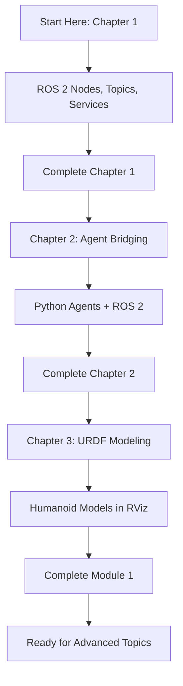

# ROS 2 Fundamentals for Humanoid Robotics

Welcome to **Module 1: ROS 2 Fundamentals for Humanoid Robotics**! This course teaches you the foundational concepts and practical skills needed to work with ROS 2 in the context of humanoid robot development.

## What You'll Learn

This module is structured in three progressive chapters:

### 📚 Chapter 1: ROS 2 Core Concepts (Priority 1 - MVP)

Learn the fundamentals of ROS 2 middleware:
- **ROS 2 Nodes**: Create and manage basic ROS 2 applications
- **Topics & Messaging**: Publish and subscribe to topics for inter-node communication
- **Services**: Implement request/response patterns for synchronous communication

**Learning Outcome**: You'll build your first ROS 2 nodes and understand how components communicate in a distributed system.

### 🤖 Chapter 2: Bridging Python AI Agents to ROS 2 (Priority 2)

Integrate Python agents with ROS 2 middleware:
- **Agent Integration**: Connect Python logic to ROS 2 using rclpy
- **Sensor Processing**: Subscribe to sensor data and process it in your agent
- **Control Commands**: Publish control signals to actuators

**Learning Outcome**: You'll create an intelligent agent that reacts to sensor data and controls robot behavior.

### 🏗️ Chapter 3: Creating Humanoid URDF Models (Priority 3)

Model humanoid robots using URDF format:
- **URDF Basics**: Understand links, joints, and kinematic trees
- **Humanoid Structure**: Design multi-link humanoid models (head, torso, arms, legs)
- **Visualization**: Use RViz to visualize and validate your models

**Learning Outcome**: You'll create a complete humanoid robot model and visualize it in RViz.

## Prerequisites

Before starting, you should have:

### Knowledge Requirements
- **Programming**: Comfortable with Python basics (variables, functions, loops)
- **Command Line**: Familiar with terminal/bash commands
- **Robotics**: Basic understanding of what robots are (no prior robotics experience needed)

### Software Requirements
- **ROS 2 Humble**: Full ROS 2 distribution (Ubuntu 22.04 recommended)
- **Python 3.8+**: Installed and working
- **Text Editor/IDE**: VS Code, PyCharm, or similar
- **Git**: For version control

## How to Use This Course

1. **Start with Chapter 1**: Begin with ROS 2 Core Concepts to build foundational knowledge
2. **Follow the Code Examples**: Each section includes runnable Python code you can execute
3. **Try the Hands-On Exercises**: Work through labs to reinforce concepts
4. **Use the Troubleshooting Guide**: Reference common issues and solutions
5. **Use the RAG Chatbot**: Ask questions about the course content using the chatbot widget

## Key Features

### 📖 Clear, Beginner-Friendly Content
Every concept is explained in simple language with real-world examples. No unexplained jargon!

### 💻 Runnable Code Examples
All code examples are complete, commented, and ready to run on ROS 2 Humble. Copy-paste and execute!

### 🔧 Hands-On Labs
Learn by doing. Each chapter includes practical exercises with expected outputs.

### 📊 Mermaid Diagrams
Visual explanations of ROS 2 concepts and system architecture.

### ❓ RAG-Powered Q&A
Ask questions about the course content and get answers sourced from the book. The chatbot widget in the bottom-right corner is powered by AI.

### 🧪 Automated Validation
All code examples are tested in ROS 2 Docker containers via CI/CD to ensure they work reliably.

## Learning Path

## Time Commitment

- **Chapter 1**: 2-3 hours (nodes, topics, services)
- **Chapter 2**: 2-3 hours (agent integration)
- **Chapter 3**: 2-3 hours (URDF modeling)
- **Total**: ~6-9 hours for complete module

## Getting Help

### If you get stuck:
1. Check the **Troubleshooting** section in each chapter
2. Review the **Code Comments** for detailed explanations
3. Use the **RAG Chatbot** to ask questions about concepts
4. Check the [ROS 2 Official Documentation](https://docs.ros.org/en/humble/)

## Next Steps

Ready to start? Head to **Chapter 1: ROS 2 Core Concepts** to begin your journey!

Good luck, and happy learning! 🚀
