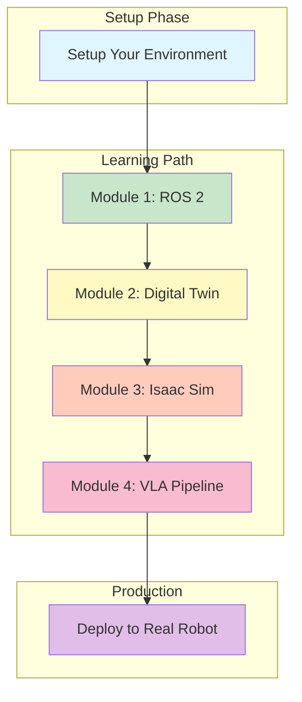

# Introduction to Physical AI & Humanoid Robotics

Welcome to the **Physical AI & Humanoid Robotics Textbook**! This comprehensive course teaches you everything needed to develop, simulate, and deploy vision-language-action (VLA) systems on humanoid robots using ROS 2, NVIDIA Isaac Sim, and advanced AI techniques.

## Course Structure

This textbook is divided into **4 comprehensive modules** that progress from fundamentals to advanced implementation:

### Module 1: ROS 2 Fundamentals for Humanoid Robotics

Master the ROS 2 middleware and robot modeling:
- **ROS 2 Core**: Nodes, topics, services, and actions
- **Agent Bridging**: Connect Python agents to ROS 2
- **URDF Modeling**: Design humanoid robot structures

**Time**: Weeks 3-5 | **Prerequisites**: Basic Python programming

### Module 2: The Digital Twin (Gazebo & Unity Simulation)

Build and simulate virtual robots in realistic environments:
- **Digital Twin Concepts**: Virtual representations of physical systems
- **Gazebo Physics**: Physics simulation and sensor modeling
- **World Building**: Create complex environments and scenarios
- **Sensor Simulation**: Realistic sensor data generation
- **Unity Visualization**: 3D visualization and interaction

**Time**: Weeks 6-7 | **Prerequisites**: Module 1 completed

### Module 3: The AI-Robot Brain (NVIDIA Isaac Sim)

Leverage advanced simulation and AI for robot perception:
- **Isaac Sim Fundamentals**: NVIDIA's physics and AI platform
- **Synthetic Data Generation**: Create training datasets automatically
- **VSLAM**: Visual simultaneous localization and mapping
- **Nav2 Path Planning**: Autonomous navigation

**Time**: Weeks 8-10 | **Prerequisites**: Module 2 completed

### Module 4: Vision-Language-Action Pipeline

Build the complete VLA system for humanoid control:
- **Whisper Speech Recognition**: Voice-to-text interface
- **LLM Cognitive Planning**: Use large language models for task planning
- **ROS 2 Actions**: Execute planned actions on the robot
- **Complete VLA Pipeline**: Integrate everything into one system

**Time**: Weeks 11-13 | **Prerequisites**: Module 3 completed

## Prerequisites

Before starting, you should have:

### Knowledge Requirements
- **Programming**: Comfortable with Python basics (variables, functions, loops)
- **Command Line**: Familiar with terminal/bash commands
- **Robotics**: Basic understanding of what robots are (no prior robotics experience needed)

### Software Requirements
- **ROS 2 Humble**: Full ROS 2 distribution (Ubuntu 22.04 recommended)
- **Python 3.8+**: Installed and working
- **Text Editor/IDE**: VS Code, PyCharm, or similar
- **Git**: For version control

## Getting Started

### Step 1: Choose Your Environment
- **[Setup Guides](/setup/setup-intro)**: Configure your development environment (Workstation, Edge Kit, or Cloud)

### Step 2: Follow the Learning Path
1. Start with **[Module 1: ROS 2 Fundamentals](/module1/intro)**
2. Progress to **[Module 2: Digital Twin](/module2/intro)**
3. Learn **[Module 3: Isaac Sim & AI](/module3/intro)**
4. Master **[Module 4: Vision-Language-Action Pipeline](/module4/intro)**

### Step 3: Hands-On Practice
- Each chapter includes **code examples** you can run immediately
- Complete **labs and exercises** to reinforce learning
- Build your own projects using provided templates

### Step 4: Get Help
- **Reference**: Check the [Glossary & References](/glossary)
- **Documentation**: Use the troubleshooting sections in each chapter
- **Resources**: Visit official docs for [ROS 2](https://docs.ros.org/), [Gazebo](https://gazebosim.org/), [Isaac Sim](https://developer.nvidia.com/isaac/)

## Key Features

### 📖 Clear, Beginner-Friendly Content
Every concept is explained in simple language with real-world examples. No unexplained jargon!

### 💻 Runnable Code Examples
All code examples are complete, commented, and ready to run on ROS 2 Humble. Copy-paste and execute!

### 🔧 Hands-On Labs
Learn by doing. Each chapter includes practical exercises with expected outputs.

### 📊 Mermaid Diagrams
Visual explanations of ROS 2 concepts and system architecture.

### ❓ RAG-Powered Q&A
Ask questions about the course content and get answers sourced from the book. The chatbot widget in the bottom-right corner is powered by AI.

### 🧪 Automated Validation
All code examples are tested in ROS 2 Docker containers via CI/CD to ensure they work reliably.

## Complete Learning Journey

## Time Commitment by Module

| Module | Topics | Weeks | Hours |
|--------|--------|-------|-------|
| Setup | Environment Configuration | 1-2 | 2-4 |
| Module 1 | ROS 2 Fundamentals | 3-5 | 12-15 |
| Module 2 | Digital Twin & Simulation | 6-7 | 10-12 |
| Module 3 | AI-Robot Brain & Perception | 8-10 | 12-15 |
| Module 4 | Vision-Language-Action | 11-13 | 12-15 |
| **Total** | **Complete Curriculum** | **13 weeks** | **48-61 hours** |

## What You'll Be Able to Do

After completing this course, you'll be able to:

✅ **Design and implement ROS 2 applications** for robotic systems
✅ **Create digital twins** of robots for simulation and testing
✅ **Use physics engines** (Gazebo, Isaac Sim) for realistic simulation
✅ **Build AI-powered perception systems** with computer vision and SLAM
✅ **Implement vision-language-action pipelines** for task planning and execution
✅ **Deploy models to edge devices** (NVIDIA Jetson) for real-time control
✅ **Work with humanoid robots** and multi-agent systems
✅ **Scale applications** to cloud platforms using Docker and Kubernetes

## Complete Navigation

### 🛠️ Setup Guides

Get your environment ready:

- **[Setup Guides Overview](/setup/setup-intro)** - Compare three deployment models
- **[Digital Twin Workstation Setup](/setup/setup-workstation)** - Local development on PC/Mac/Linux
- **[Physical AI Edge Kit Setup](/setup/setup-edge-kit)** - Deploy to NVIDIA Jetson
- **[Cloud-Native Development Setup](/setup/setup-cloud)** - Docker & Kubernetes

### 📚 Learning Modules

Progress through the complete curriculum:

- **[Module 1: ROS 2 Fundamentals](/module1/intro)** - Learn ROS 2 core concepts
  - [Chapter 1: ROS 2 Core Concepts](/module1/ch1-ros2-core)
  - [Chapter 2: Agent Bridging](/module1/ch2-agent-bridge)
  - [Chapter 3: URDF Modeling](/module1/ch3-urdf-model)

- **[Module 2: Digital Twin](/module2/intro)** - Build virtual simulations
  - [Chapter 1: Digital Twin Concepts](/module2/ch1-digital-twin-concepts)
  - [Chapter 2: Gazebo Physics](/module2/ch2-gazebo-physics)
  - [Chapter 3: World Building](/module2/ch3-world-building)
  - [Chapter 4: Sensor Simulation](/module2/ch4-sensor-simulation)
  - [Chapter 5: Unity Visualization](/module2/ch5-unity-visualization)

- **[Module 3: Isaac Sim & AI](/module3/intro)** - Advanced robot brain
  - [Chapter 1: Isaac Sim Fundamentals](/module3/ch1-isaac-sim-fundamentals)
  - [Chapter 2: Synthetic Data Generation](/module3/chapter2-synthetic-data)
  - [Chapter 3: VSLAM](/module3/chapter3-vslam)
  - [Chapter 4: Nav2 Path Planning](/module3/chapter4-nav2)

- **[Module 4: Vision-Language-Action Pipeline](/module4/intro)** - Complete VLA system
  - [Chapter 1: Whisper Speech Recognition](/module4/ch1-whisper)
  - [Chapter 2: LLM Cognitive Planning](/module4/ch2-llm-planning)
  - [Chapter 3: ROS 2 Actions Integration](/module4/ch3-ros2-actions)
  - [Chapter 4: Complete VLA Pipeline](/module4/ch4-complete-vla)

### 📖 References

- **[Robotics Glossary & References](/glossary)** - Key terms and resources

---

## Quick Start Paths

### 👨‍💻 Path 1: Complete Beginner

1. Setup your environment: [Digital Twin Workstation](/setup/setup-workstation)
2. Start learning: [Module 1 - ROS 2 Fundamentals](/module1/intro)
3. Follow sequentially: Module 2 → Module 3 → Module 4

### 🚀 Path 2: Experienced with ROS 2

1. Review setup if needed: [Setup Guides](/setup/setup-intro)
2. Jump to: [Module 2 - Digital Twin](/module2/intro)
3. Continue: Module 3 → Module 4

### 🤖 Path 3: Ready for Hardware

1. Choose your deployment:
   - Edge device? → [Edge Kit Setup](/setup/setup-edge-kit)
   - Cloud deployment? → [Cloud Setup](/setup/setup-cloud)
2. Study the complete curriculum first
3. Deploy to production

---

**Good luck, and welcome to the exciting world of Humanoid Robotics! 🚀**
