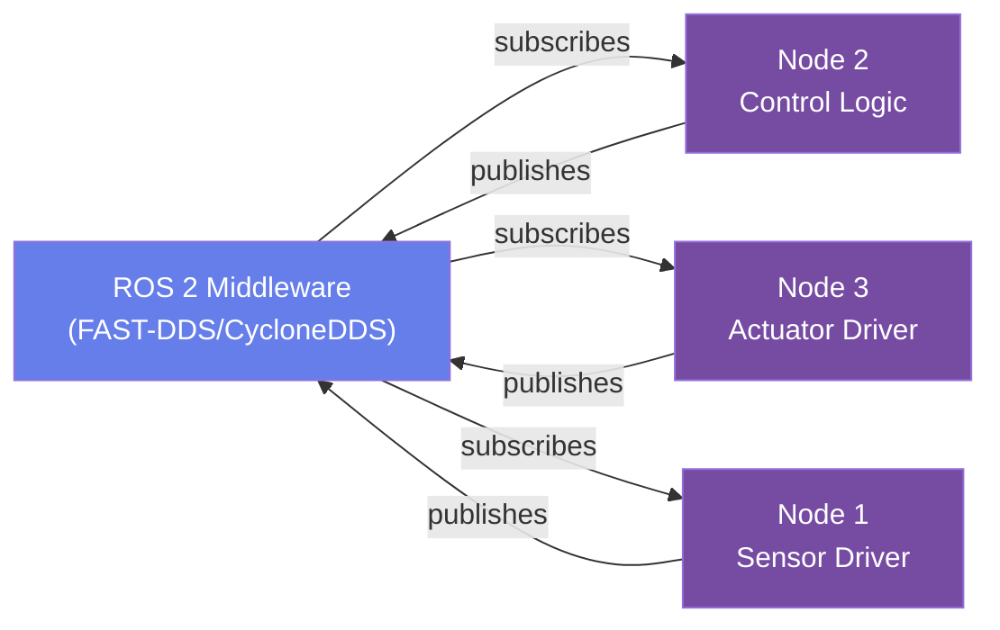
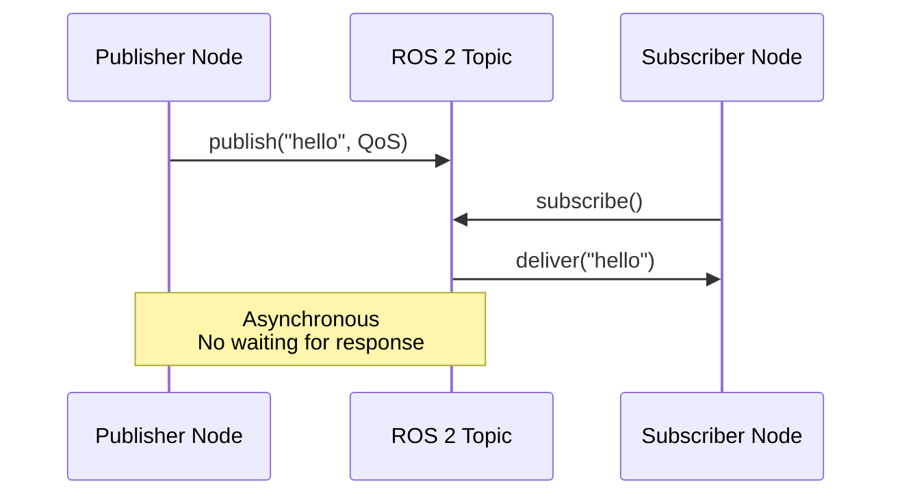

# Chapter 1: ROS 2 Core Concepts

## Learning Objectives

By the end of this chapter, you will:
- **Understand ROS 2 fundamentals**: Nodes, topics, services, and the pub/sub pattern
- **Create your first ROS 2 node**: Write and execute a minimal ROS 2 application in Python
- **Master topic communication**: Publish messages to topics and subscribe to receive them
- **Implement service calls**: Create service servers and clients for request/response patterns
- **Use ROS 2 CLI tools**: Verify communication with `ros2 topic echo` and `ros2 service call`

## Prerequisites

### Knowledge Requirements
- **Python Basics**: Variables, functions, classes, imports, and if/else logic
- **Command Line**: Comfortable with terminal/shell commands (cd, ls, export, source)
- **Package Management**: Familiar with pip or apt (basic package installation)

### Software Requirements
- **ROS 2 Humble**: Full distribution installed on Ubuntu 22.04 LTS
  - Install with: `sudo apt install ros-humble-desktop-full`
  - Verify with: `printenv ROS_DISTRO` (should output "humble")
- **Python 3.8+**: Usually comes with ROS 2
  - Check with: `python3 --version`
- **VS Code or similar editor**: For writing Python code
- **Git**: For version control (optional but recommended)

## Concepts

### What is ROS 2?

**ROS 2 (Robot Operating System 2)** is a flexible framework for writing robot software. It's a collection of tools and libraries that help you build complex robot applications by breaking them into small, reusable components.

Think of ROS 2 like an orchestral conductor:
- Each musician (ROS 2 node) plays their own part
- They synchronize through a shared score (ROS 2 middleware)
- The conductor ensures everyone works together harmoniously



### ROS 2 Nodes

A **node** is an independent program that performs a specific task. Nodes are the building blocks of ROS 2 applications.

**Characteristics of nodes:**
- Run independently (even on different machines)
- Communicate asynchronously through topics and services
- Have a unique name within the ROS 2 system
- Can be written in Python, C++, or other supported languages

**Real-world analogy:** A robot's sensor driver is one node, the motion planner is another, and the motor controller is a third node. Each does its job independently but coordinates through ROS 2.

#### Example: Minimal Node

```python title="hello_ros2.py" showLineNumbers
#!/usr/bin/env python3

import rclpy
from rclpy.node import Node

class HelloNode(Node):
    """A minimal ROS 2 node that logs a message."""

    def __init__(self):
        # Initialize the node with a unique name
        super().__init__('hello_node')

        # Log a message when the node starts
        self.get_logger().info('Hello from ROS 2!')

def main(args=None):
    """Entry point for the ROS 2 application."""
    # Initialize ROS 2 client library
    rclpy.init(args=args)

    # Create and instantiate the node
    node = HelloNode()

    # Keep the node running (spin) until interrupted (Ctrl+C)
    rclpy.spin(node)

    # Cleanup when shutting down
    node.destroy_node()
    rclpy.shutdown()

if __name__ == '__main__':
    main()
```

**Key concepts:**
- **Line 1-2**: Shebang and imports for ROS 2
- **Line 5-6**: Inherit from `rclpy.node.Node` to create a ROS 2 node
- **Line 9-11**: Constructor initializes the node with name 'hello_node'
- **Line 12**: `self.get_logger()` provides logging for debugging
- **Line 15-27**: Main entry point that initializes ROS 2 and runs the node

### Topics and Publish/Subscribe

A **topic** is a named channel for one-way asynchronous communication. Nodes publish messages to topics, and other nodes subscribe to receive them.

**Use cases for topics:**
- Sensor data (continuous streams like camera, lidar, IMU)
- Status updates (battery level, state changes)
- Control signals (velocity commands, gripper position)
- Any data that changes frequently and doesn't require a response



### Topics and Publish/Subscribe (Continued)

#### Publisher Example

```python title="publisher.py" showLineNumbers
#!/usr/bin/env python3

import rclpy
from rclpy.node import Node
from std_msgs.msg import String

class PublisherNode(Node):
    """Node that publishes messages to a topic."""

    def __init__(self):
        super().__init__('publisher_node')

        # Create a publisher to the 'greeting' topic
        self.publisher = self.create_publisher(String, 'greeting', 10)

        # Create a timer to publish every 1 second
        timer_period = 1.0
        self.timer = self.create_timer(timer_period, self.publish_message)
        self.counter = 0

    def publish_message(self):
        """Publish a message to the topic."""
        msg = String()
        msg.data = f'Hello from ROS 2! Message #{self.counter}'
        self.publisher.publish(msg)
        self.get_logger().info(f'Published: {msg.data}')
        self.counter += 1

def main(args=None):
    rclpy.init(args=args)
    node = PublisherNode()
    rclpy.spin(node)
    node.destroy_node()
    rclpy.shutdown()

if __name__ == '__main__':
    main()
```

#### Subscriber Example

```python title="subscriber.py" showLineNumbers
#!/usr/bin/env python3

import rclpy
from rclpy.node import Node
from std_msgs.msg import String

class SubscriberNode(Node):
    """Node that subscribes to messages from a topic."""

    def __init__(self):
        super().__init__('subscriber_node')

        # Create a subscriber to the 'greeting' topic
        self.subscription = self.create_subscription(String, 'greeting', self.message_callback, 10)

    def message_callback(self, msg):
        """Callback function called when a message is received."""
        self.get_logger().info(f'Received: {msg.data}')

def main(args=None):
    rclpy.init(args=args)
    node = SubscriberNode()
    rclpy.spin(node)
    node.destroy_node()
    rclpy.shutdown()

if __name__ == '__main__':
    main()
```

### Services and Request/Response

A **service** is two-way synchronous communication. One node makes a request and waits for a response.

**Use cases for services:**
- Database queries (request sensor data, get configuration)
- One-time actions (calibrate sensor, take a photo, compute path)
- Anything that requires a response before proceeding

#### Service Server Example

```python title="service_server.py" showLineNumbers
#!/usr/bin/env python3

import rclpy
from rclpy.node import Node
from example_interfaces.srv import AddTwoInts

class ServiceServerNode(Node):
    """Node that provides a service."""

    def __init__(self):
        super().__init__('service_server_node')

        # Create a service called 'add_two_ints'
        self.service = self.create_service(AddTwoInts, 'add_two_ints', self.add_ints_callback)

    def add_ints_callback(self, request, response):
        """Callback when a service request is received."""
        response.sum = request.a + request.b
        self.get_logger().info(f'Request: {request.a} + {request.b} = {response.sum}')
        return response

def main(args=None):
    rclpy.init(args=args)
    node = ServiceServerNode()
    rclpy.spin(node)
    node.destroy_node()
    rclpy.shutdown()

if __name__ == '__main__':
    main()
```

## Cross-Module Connections

**Module 1 → Module 2 (Digital Twin)**:
- The ROS 2 topics you learned here will carry sensor data from Gazebo and Unity simulations
- Nodes communicate with the simulator through the same pub/sub patterns

**Module 1 → Module 3 (Perception)**:
- VSLAM (Visual Simultaneous Localization and Mapping) runs as ROS 2 nodes publishing pose estimates
- Nav2 path planning receives robot state from topics and publishes navigation commands
- All perception feedback loops use ROS 2 topics and services you learned here

**Module 1 → Module 4 (VLA Pipeline)**:
- Speech recognition results arrive as ROS 2 messages on topics
- LLM planning decisions are published as action goals
- Robot execution feedback returns through ROS 2 topics

## Summary

This chapter covered ROS 2 core concepts: nodes, topics, and services. You learned how to create independent components that communicate asynchronously (topics) and synchronously (services). These patterns form the foundation for all robot communication in Modules 2-4.

## Acronym Reference

| Acronym | Full Name | Definition |
|---------|-----------|-----------|
| **ROS 2** | Robot Operating System 2 | Middleware framework for robot software development |
| **pub/sub** | Publish/Subscribe | Asynchronous communication pattern where publishers send data to topics and subscribers receive it |
| **QoS** | Quality of Service | Settings for ROS 2 communication reliability and latency |
| **DDS** | Data Distribution Service | Underlying middleware protocol for ROS 2 communication |
| **FAST-DDS** | Fast Implementations of Real-Time Middleware (DDS) | Default DDS implementation in ROS 2 Humble |
| **CycloneDDS** | Alternative DDS Implementation | Compatible DDS implementation for ROS 2 |
| **rclpy** | ROS Client Library Python | Python library for writing ROS 2 nodes |
| **API** | Application Programming Interface | Set of functions and protocols for software interaction |
| **CLI** | Command-Line Interface | Terminal-based tool for interacting with ROS 2 |
| **URDF** | Unified Robot Description Format | XML format for describing robot structure |

## Additional Resources

- [ROS 2 Official Documentation](https://docs.ros.org/en/humble/)
- [ROS 2 Tutorials](https://docs.ros.org/en/humble/Tutorials.html)
