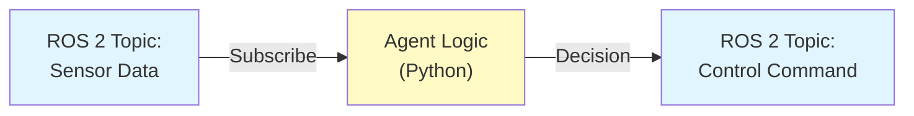

# Chapter 2: Bridging Python Agents to ROS 2

## Learning Objectives

By the end of this chapter, you will:
1. Understand the concept of autonomous agents and their role in robotics
2. Learn how to create a Python agent with decision-making logic
3. Integrate an agent with ROS 2 using rclpy
4. Implement sensor subscription and control publishing patterns
5. Design agent-ROS 2 communication flows
6. Test agents both independently and integrated with ROS 2

## Prerequisites

- **Chapter 1 Completion**: You should be familiar with ROS 2 nodes, topics, and basic rclpy patterns
- **Python Knowledge**: Classes, inheritance, callbacks, and basic Python patterns
- **Environment**: ROS 2 Humble installed and sourced
- **Tools**: Text editor, terminal, and `ros2` CLI tools

---

## Section 1: Understanding Agent Architecture

### What is an Agent?

In robotics, an **agent** is an autonomous decision-making entity that:
- Perceives the environment (through sensors)
- Reasons about the situation (using logic or algorithms)
- Takes actions (by issuing commands)

**Key insight**: An agent is a **unit of decision-making logic**, separate from communication.

### Agent Architecture Diagram



**How it works**:
1. **Sensor Input**: Robot subscribes to ROS 2 topics (e.g., `/lidar/distance`)
2. **Agent Logic**: Python code processes sensor data and makes decisions
3. **Control Output**: Agent publishes decisions back to ROS 2 topics (e.g., `/cmd_vel` for movement)

### Agent vs. Node: Key Difference

While a ROS 2 **node** handles communication, an **agent** handles decision-making:

| Aspect | Agent | Node |
|--------|-------|------|
| **Purpose** | Decision-making logic | ROS 2 communication |
| **Dependencies** | Pure Python (optional: ML frameworks) | rclpy, ROS 2 |
| **Testability** | Can test offline | Requires ROS 2 running |
| **Reusability** | Use in multiple systems | Tied to ROS 2 |

**Example**:
- Agent: "If distance < 1m, turn left"
- Node: "Subscribe to `/distance` topic and call agent callback"

### Why Separate Agent from Node?

**Benefits of this architecture:**

1. **Testability**: Test agent logic without ROS 2
2. **Reusability**: Use the same agent in different ROS 2 setups
3. **Clarity**: Code clarity improves
4. **Development**: Develop independently

---

## Section 2: Building Your First Agent

### The SimpleAgent Class

Let's look at a basic agent:

```python
class SimpleAgent:
    """Simple agent with decision logic."""

    def __init__(self):
        self.decision_counter = 0
        self.last_sensor_reading = 0.0

    def process_sensor_data(self, sensor_reading):
        """Process sensor input and return decision."""
        self.last_sensor_reading = sensor_reading
        return self.make_decision()

    def make_decision(self):
        """Generate control command based on state."""
        self.decision_counter += 1

        if self.decision_counter % 5 == 0:
            return "turn_left"
        elif self.last_sensor_reading > 7.0:
            return "turn_right"
        else:
            return "move_forward"
```

### Testing Agent Offline

**Huge advantage**: Test without ROS 2!

```bash
python3 examples/module1/chapter2/simple_agent.py
```

Expected output:
```
Sensor:  2.5 | Decision: move_forward    | Count: 1
Sensor:  8.5 | Decision: turn_right      | Count: 6
...
[SUCCESS] Agent ran successfully without ROS 2 dependency
```

---

## Section 3: Sensor Subscription Pattern

### Receiving Sensor Data

Integrate your agent with ROS 2 to receive real sensor data:

```python
class SensorBridgeNode(Node):
    """Subscribe to sensors and bridge to agent."""

    def __init__(self):
        super().__init__('sensor_bridge_node')
        self.agent = SimpleAgent()

        # Subscribe to sensor topic
        self.subscription = self.create_subscription(
            Float32,
            'sensor_data',
            self.sensor_callback,
            10
        )

    def sensor_callback(self, msg):
        """Called when sensor message arrives."""
        decision = self.agent.process_sensor_data(msg.data)
        self.get_logger().info(f'Decision: {decision}')
```

### Running the Sensor Bridge

**Terminal 1**:
```bash
source /opt/ros/humble/setup.bash
python3 examples/module1/chapter2/sensor_bridge.py
```

**Terminal 2** (send test data):
```bash
source /opt/ros/humble/setup.bash
ros2 topic pub /sensor_data std_msgs/Float32 "{data: 5.0}" --once
```

Expected in Terminal 1:
```
[INFO] [sensor_bridge_node]: Sensor Bridge Node started
[INFO] [sensor_bridge_node]: Received sensor: 5.0
[INFO] [sensor_bridge_node]: Agent decision: move_forward
```

---

## Section 4: Control Publishing Pattern

### Publishing Agent Decisions

Publish agent decisions back to ROS 2:

```python
class ControlPublisherNode(Node):
    """Publish agent decisions as control commands."""

    def __init__(self):
        super().__init__('control_publisher_node')
        self.agent = SimpleAgent()

        self.publisher = self.create_publisher(
            String, 'control_command', 10
        )

        # Publish every 500ms (2Hz)
        self.timer = self.create_timer(0.5, self.timer_callback)

    def timer_callback(self):
        """Called every 500ms."""
        decision = self.agent.make_decision()
        msg = String()
        msg.data = decision
        self.publisher.publish(msg)
        self.get_logger().info(f'Publishing: {decision}')
```

### Running the Control Publisher

**Terminal 1**:
```bash
source /opt/ros/humble/setup.bash
python3 examples/module1/chapter2/control_publisher.py
```

**Terminal 2** (listen):
```bash
source /opt/ros/humble/setup.bash
ros2 topic echo /control_command
```

Expected in Terminal 1:
```
[INFO] [control_publisher_node]: Control Publisher Node started
[INFO] [control_publisher_node]: Publishing control: move_forward
[INFO] [control_publisher_node]: Publishing control: turn_left
```

---

## Section 5: Hands-On Lab

### Lab Objective

Run complete agent-ROS 2 integration where sensor data flows through an agent and generates commands.

### Step 1: Test Simple Agent

```bash
cd examples/module1/chapter2
python3 simple_agent.py
```

### Step 2: Run All Three Components

**Terminal 1**: `python3 sensor_bridge.py`

**Terminal 2**: `python3 control_publisher.py`

**Terminal 3**: `ros2 topic echo /control_command`

**Terminal 4**: `ros2 topic pub /sensor_data std_msgs/Float32 "{data: 2.0}" --once`

### Step 3: Verify the Flow

- Terminal 1: Shows received sensor values
- Terminal 2: Shows published commands at 2Hz
- Terminal 3: Shows the stream of commands
- Terminal 4: Sends test data

### Verification Checklist

- [ ] simple_agent.py runs standalone
- [ ] Sensor Bridge logs received messages
- [ ] Control Publisher publishes regularly
- [ ] Commands appear in topic echo
- [ ] Modifying agent logic changes behavior

---

## Section 6: Troubleshooting

| Problem | Cause | Solution |
|---------|-------|----------|
| `ModuleNotFoundError: No module named 'rclpy'` | ROS 2 not sourced | Run `source /opt/ros/humble/setup.bash` |
| "Sensor Bridge shows no output" | No sensor data published | Use Terminal 4 to send test data |
| `ros2: command not found` | ROS 2 not in PATH | Source ROS 2 setup script |
| Agent not imported | Not in chapter2 directory | `cd examples/module1/chapter2` |
| Changes not reflecting | File changes not saved | Restart the node after editing |

---

## Key Takeaways

1. **Agents are decision-makers**: Separate logic from ROS 2
2. **Testing is offline**: Test before ROS 2 integration
3. **Callbacks are async**: Sensor data triggers callbacks
4. **Timers are sync**: Control publishes at regular intervals
5. **Pattern is modular**: Three components work together cleanly
6. **Topics connect**: ROS 2 topics link agent to rest of system

---

## Cross-Module Connections

**Module 1 → Module 2 (Digital Twin)**:
- Your agents will receive simulated sensor data from Gazebo
- Test agent decision-making against realistic physics before real-world deployment
- Publish control commands to simulated robots and see the results

**Module 1 → Module 3 (Perception)**:
- VSLAM and Nav2 nodes publish perception estimates (pose, map, planned path)
- Your agents subscribe to these topics to understand robot state
- Perception feedback refines agent decisions in real-time

**Module 1 → Module 4 (VLA Pipeline)**:
- LLM planning nodes process language and generate action goals
- Your agent patterns execute these goals through ROS 2 action servers
- Feedback loops ensure actions complete successfully

## Next Steps

### Immediate Extensions

1. **Add filtering**: Moving averages for sensor data
2. **Add states**: Behavior trees or finite state machines
3. **Add parameters**: Tune thresholds with ROS 2 parameters

### Advanced Topics (Module 2+)

- Simulation in Gazebo
- Reinforcement learning for agents
- Motion planning integration
- Computer vision processing

---

## Acronym Reference

| Acronym | Full Name | Definition |
|---------|-----------|-----------|
| **AI** | Artificial Intelligence | Computer systems that simulate intelligent behavior |
| **ML** | Machine Learning | Subset of AI where systems learn from data |
| **rclpy** | ROS Client Library Python | Python library for writing ROS 2 nodes and agents |
| **API** | Application Programming Interface | Set of functions for software interaction |
| **FSM** | Finite State Machine | System with discrete states and transitions |
| **BT** | Behavior Tree | Hierarchical decision-making structure for agent control |
| **Hz** | Hertz | Unit of frequency (cycles per second) |
| **ROS 2** | Robot Operating System 2 | Middleware framework for robot software |
| **pub/sub** | Publish/Subscribe | Asynchronous messaging pattern |
| **ID** | Identifier | Unique name for a ROS 2 component |

## Resources

- [rclpy Documentation](https://docs.ros.org/en/humble/Tutorials/Beginner-Client-Libraries/Writing-A-Simple-Py-Subscriber-And-Publisher.html)
- [ROS 2 Topics](https://docs.ros.org/en/humble/Tutorials/Beginner-CLI-Tools/Understanding-ROS2-Topics/Understanding-ROS2-Topics.html)
- Chapter 2 Examples: `examples/module1/chapter2/`

