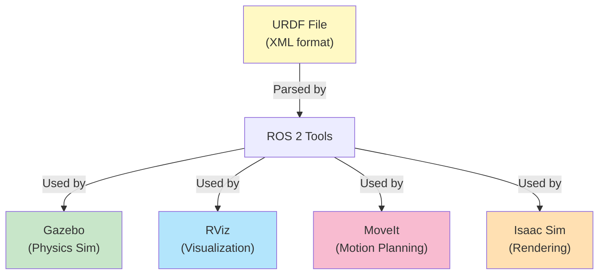
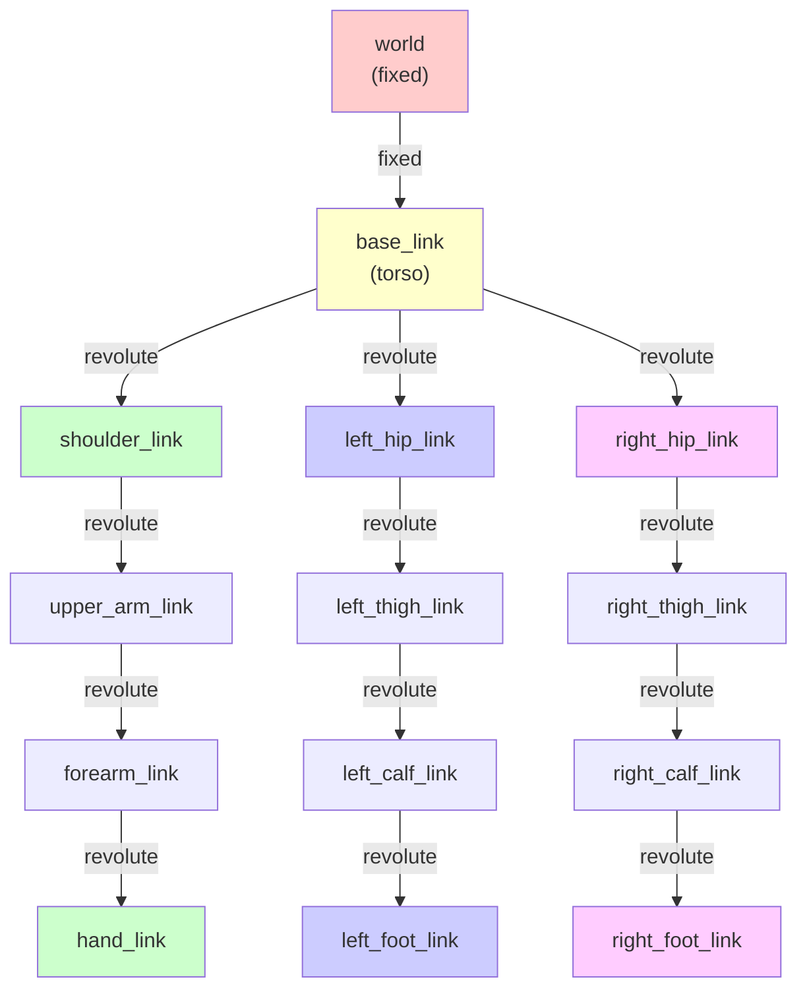

# Chapter 3: Creating Humanoid URDF Models

## Learning Objectives

By the end of this chapter, you will:
1. Understand URDF (Unified Robot Description Format) as XML-based robot description
2. Define links (rigid bodies) and joints (connections)
3. Create a humanoid robot model with multiple limbs
4. Validate URDF files using ROS 2 tools
5. Visualize URDF models in RViz
6. Modify joint parameters and re-validate

## Prerequisites

- **Chapters 1-2 Completion** (recommended)
- **Basic XML Knowledge**: Understanding of tags and nesting
- **Environment**: Python 3.8+, ROS 2 Humble

---

## Section 1: Introduction to URDF

**URDF** = Unified Robot Description Format

An XML file that describes:
- **Structure**: How links (rigid bodies) connect via joints
- **Physics**: Mass, inertia, friction
- **Appearance**: Visual geometry for RViz
- **Collision**: Shapes for planning

### Why URDF?

URDF is the **ROS 2 standard** for robot models:
- Used by Gazebo, CoppeliaSim (simulation)
- Used by MoveIt! (motion planning)
- Used by RViz (visualization)
- Human-readable XML format



---

## Section 2: Links and Joints

### Links: Rigid Bodies

```xml
<link name="torso_link">
  <inertial>
    <mass value="20.0"/>
    <inertia ixx="0.5" ixy="0" ixz="0" iyy="0.5" iyz="0" izz="0.3"/>
  </inertial>
  <visual>
    <geometry>
      <cylinder radius="0.15" length="0.6"/>
    </geometry>
  </visual>
  <collision>
    <geometry>
      <cylinder radius="0.15" length="0.6"/>
    </geometry>
  </collision>
</link>
```

**Properties**: Inertial (physics), Visual (appearance), Collision (planning)

### Joints: Connections

```xml
<joint name="torso_to_shoulder" type="revolute">
  <parent link="torso_link"/>
  <child link="shoulder_link"/>
  <origin xyz="0.25 0.2 0.4" rpy="0 0 0"/>
  <axis xyz="0 1 0"/>
  <limit lower="-1.57" upper="1.57" effort="10" velocity="1.0"/>
</joint>
```

### URDF Tree Structure: A Humanoid Robot Example

Every URDF describes a **kinematic tree** where links are connected by joints:



**Key concept**: URDF describes the robot's **skeleton**—how body parts connect and can move.
- **Links** = rectangular nodes (rigid bodies with mass and geometry)
- **Joints** = arrows connecting links (revolute, prismatic, or fixed)
- **Tree structure** = No loops (valid kinematic chain)

**Joint Types**: revolute (rotation), prismatic (linear), fixed (rigid)

---

## Section 3: Humanoid Structure

### Basic Anatomy

```
          HEAD
           |
LEFT ARM--TORSO--RIGHT ARM
           |
LEFT LEG--HIPS--RIGHT LEG
```

### Our Model (simple_humanoid.urdf)

- **15 links** (including base)
- **14 joints** (12 revolute, 2 fixed)
- **~40 kg** total mass
- **12 degrees of freedom**

**Structure**:
- Torso: main body (20 kg)
- Head: attached to torso (3 kg)
- 2 Arms: shoulder + elbow + wrist (3 joints each)
- 2 Legs: hip + knee + ankle (3 joints each)

---

## Section 4: Hands-On Lab

### Step 1: Parse URDF (No ROS 2 Required)

```bash
cd examples/module1/chapter3
python3 visualize_urdf.py
```

**Output shows**:
- Robot structure (15 links, 14 joints)
- Link properties (inertial, visual, collision)
- Kinematic tree hierarchy
- Validation result

### Step 2: Validate with ROS 2

```bash
source /opt/ros/humble/setup.bash
check_urdf simple_humanoid.urdf
```

**Confirms**:
-  Valid XML syntax
-  No kinematic cycles
-  All links and joints properly connected

### Step 3: Modify and Re-validate

Edit joint limits in `simple_humanoid.urdf`:

```xml
<!-- Increase shoulder range from 90° to 120° -->
<limit lower="-2.09" upper="2.09" effort="10" velocity="1.0"/>
```

Re-validate: `python3 visualize_urdf.py`

---

## Section 5: Troubleshooting

| Issue | Solution |
|-------|----------|
| XML syntax errors | Check for unclosed tags, proper nesting |
| Missing link reference | Ensure all parent/child links are defined |
| Invalid joint axis | Axis must be unit vector (length = 1) |
| Invalid joint type | Use: revolute, continuous, prismatic, fixed |

---

## Cross-Module Connections

**Module 1 → Module 2 (Digital Twin)**:
- Your URDF models load into Gazebo for physics-based simulation
- The simulator respects joint limits and mass properties you defined
- Simulated sensor data (camera, lidar) is attached to links via URDF

**Module 1 → Module 3 (Perception)**:
- Isaac Sim imports URDF models for photorealistic rendering
- VSLAM nodes track humanoid pose relative to the kinematic tree structure
- Nav2 path planning considers robot dimensions defined in URDF

**Module 1 → Module 4 (VLA Pipeline)**:
- Action servers command joints and links through ROS 2
- Trajectory planning respects joint limits from URDF
- Perception systems understand humanoid structure via URDF data

## Key Takeaways

1. **URDF is XML**: Hierarchical, text-based format
2. **Links are bodies**: Have mass, inertia, geometry
3. **Joints connect links**: Define motion and constraints
4. **Tree structure**: No cycles (valid robot)
5. **Validation matters**: Always use check_urdf
6. **ROS 2 standard**: Used everywhere in Modules 2-4

---

## Acronym Reference

| Acronym | Full Name | Definition |
|---------|-----------|-----------|
| **URDF** | Unified Robot Description Format | XML-based format for describing robot structure and properties |
| **XML** | Extensible Markup Language | Hierarchical text format using tags for data structure |
| **DOF** | Degrees of Freedom | Number of independent ways a robot can move |
| **RViz** | ROS Visualization | 3D visualization tool for ROS 2 robots and sensor data |
| **Gazebo** | Gazebo Simulator | Physics-based robot simulation environment |
| **MoveIt** | MoveIt Motion Planning | Robot motion and manipulation planning framework |
| **kg** | Kilogram | Unit of mass |
| **rad** | Radian | Unit of angular measurement (1 radian ≈ 57.3 degrees) |
| **Hz** | Hertz | Unit of frequency (cycles per second) |
| **API** | Application Programming Interface | Set of functions for software interaction |

## Resources

- [URDF XML Specification](https://wiki.ros.org/urdf/XML)
- [ROS 2 URDF Tutorials](https://docs.ros.org/en/humble/Tutorials/Intermediate/URDF/URDF-Main.html)
- [Gazebo URDF Guide](http://gazebosim.org/tutorials?tut=build_model)
- Chapter 3 Examples: `examples/module1/chapter3/`

