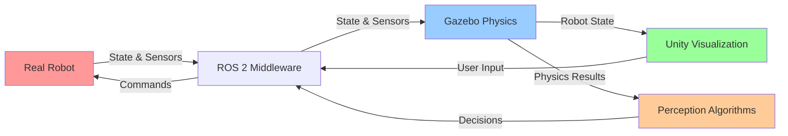

# Chapter 1: Digital Twin Fundamentals

## What is a Digital Twin?

A **digital twin** is a virtual replica of a physical robot that is **synchronized with the real-world state**. When the real robot moves, the digital twin moves the same way. When the real robot's sensors detect obstacles, the digital twin's virtual sensors read the same data.

### Real-World Example

Imagine you have a humanoid robot in a warehouse:
- **Real robot**: Standing in warehouse, equipped with cameras, LiDAR, motors
- **Digital twin**: Virtual replica running in simulation on your computer
- **Synchronization**: Every movement, sensor reading, and motor command is mirrored in the digital twin

This allows you to:
- Test new behaviors in simulation **before** running them on the real robot
- Analyze what went wrong when something fails (replay from simulation data)
- Predict outcomes of actions safely (will the robot tip over? will it collide?)

## Why Companies Use Digital Twins

### Cost Savings

```
Real Robot Training:
- Buy robot hardware: $100,000+
- Each experiment: Risk of damage ($10,000 per mistake)
- Development time: Months (can't run fast iterations)
- Total cost: $500,000+ per project

Simulation-Based Training:
- Buy software licenses: $10,000-50,000
- Each experiment: Free (no damage risk)
- Development time: Weeks (run experiments fast)
- Total cost: $50,000 per project
```

**Result**: Digital twins save 90% on development costs.

### Safety

Humanoid robots are powerful machines. Mistakes can injure people:
- Testing collision avoidance in simulation → safe
- Testing gripper force control in simulation → safe
- Debugging control algorithms in simulation → safe

After validating in simulation, the behavior is much safer when deployed on real hardware.

### Speed

Training on real robots is slow:
- Experiment takes 5 minutes on real robot
- Must wait for reset between experiments
- Limited by real-time constraints

Training in simulation is fast:
- Experiment takes 2 seconds in simulation (10x speed)
- Instant reset to initial conditions
- Run 100 experiments while real robot runs 1

## Gazebo vs. Unity: Which Tool When?

You'll use two simulation tools in this module. Here's when to use each:

### Gazebo (Physics-First Simulation)

**Purpose**: Accurate physics simulation for robotics

**Use when you need**:
- Realistic physics (gravity, collisions, friction)
- Integration with ROS 2 middleware
- Sensor simulation (LiDAR, camera, IMU)
- Fast iteration on robot behaviors

**Strengths**:
- Purpose-built for robotics
- Native ROS 2 integration
- Accurate physics simulation
- Free and open-source

**Weaknesses**:
- Basic graphics (not photorealistic)
- Limited human-robot interaction visualization
- Linux-primary (Windows requires WSL2)

### Unity (Visualization-First Engine)

**Purpose**: Photorealistic rendering for visualization and HRI

**Use when you need**:
- High-quality 3D graphics
- Human avatars for human-robot interaction
- Immersive visualization for demonstrations
- Cross-platform compatibility (Windows, Mac, Linux)

**Strengths**:
- Photorealistic graphics
- Large asset library (3D models, environments)
- Excellent for HRI (human-robot interaction)
- Easy to create custom visualizations

**Weaknesses**:
- Physics not as accurate as dedicated simulators
- Requires ROS 2 bridge (adds complexity)
- Steeper learning curve for roboticists

### The Hybrid Approach (Recommended)

Use **both together**:
1. **Gazebo** runs physics simulation of robot + environment
2. **Unity** visualizes the same scene in photorealistic graphics
3. **ROS 2 bridge** keeps them synchronized

```
Real Robot
    ↓
Gazebo (physics engine)
    ↓
ROS 2 Topics (sensor data, motor commands)
    ↓
Unity (visualization + HRI)
```

This gives you the **best of both worlds**:
- Accurate physics from Gazebo
- Beautiful graphics from Unity
- ROS 2 integration throughout

### Hybrid Architecture Diagram



**Flow**: Real robot state syncs with Gazebo (physics) and Unity (graphics). Perception algorithms run on simulated sensor data. Control decisions feed back through ROS 2 to both real and simulated robot.

## Cross-Module Connections

This chapter builds directly on concepts from earlier modules:

**From Module 1 (ROS 2 Fundamentals)**:
- Your robot's **URDF description** (Module 1, Chapter 3) is loaded into Gazebo
- **ROS 2 middleware** (Module 1, Chapter 1) keeps simulation and real robot synchronized
- **Autonomous agents** (Module 1, Chapter 2) run control loops on simulated sensor data

**To Module 3 (Isaac Sim & Perception)**:
- Simulated **sensor data** (Chapter 4) trains perception algorithms
- **VSLAM** (Visual Simultaneous Localization and Mapping) in Module 3 uses synthetic depth/camera data
- Domain randomization in simulation prepares robots for Module 3's real-world testing

**To Module 4 (VLA Pipeline)**:
- Simulated **robot state** from Gazebo feeds into language understanding
- Voice commands (Module 4) can control simulated behaviors before real deployment
- Learned policies validate in simulation before hardware deployment

## Complete Simulation Workflow

Here's how digital twins fit into robot development:

```
1. Design Phase (Computer)
   - CAD model of robot
   - Create URDF (from Module 1)
   - Design robot structure

2. Simulation Phase (This Module)
   - Load URDF into Gazebo
   - Create simulated world
   - Add sensors (LiDAR, cameras)
   - Test behaviors in simulation

3. Validation Phase (Simulation)
   - Does robot stand stably?
   - Do sensors work correctly?
   - Can control algorithms handle physics?
   - Iterate until happy with results

4. Deployment Phase (Real Robot)
   - Move behavior code to real robot
   - Tune parameters for real hardware
   - Monitor real robot behavior
   - Compare with simulation predictions

5. Feedback Phase (Real Data)
   - Record real robot data
   - Compare sim vs. real
   - Update simulation if needed
   - Cycle back to phase 2 if issues found
```

## Key Concepts: Terminology

Let's define some terms you'll see throughout Module 2:

### Physics Simulation

**Physics engine**: Software that calculates how objects move, collide, and interact
- Gravity pulls objects down
- Collisions prevent objects from passing through each other
- Friction slows sliding objects
- Inertia resists acceleration

**Real-time factor**: How fast simulation runs relative to wall-clock time
- Real-time factor = 1.0 means simulation runs at real speed (good)
- Real-time factor = 0.5 means simulation runs at half speed (slower, but still usable)
- Real-time factor < 0.3 means simulation is too slow (need to optimize)

### Robot Representation

**URDF (Unified Robot Description Format)**: XML file describing robot structure
- Links: Rigid bodies of the robot
- Joints: Connections between links with degrees of freedom
- Inertia: Mass distribution (important for realistic physics)
- Sensors: Cameras, LiDAR, IMU mounted on robot

**Collision geometry**: Simplified shapes used for contact detection
- Complex 3D models are slow to simulate
- Use simple shapes (boxes, cylinders, spheres) for collision
- Reduces computation while maintaining accuracy

### Sensor Simulation

**LiDAR**: Laser range finder measuring distances
- Emits light pulses
- Measures time to reflection
- Outputs: point cloud (array of 3D points)
- Simulated by ray-casting from obstacles to sensor

**Depth camera**: RGB-D camera providing color + depth
- Outputs: color image + depth map (distance to each pixel)
- Simulated by rendering scene from camera viewpoint

**IMU**: Inertial Measurement Unit
- Outputs: acceleration (3 axes), angular velocity (3 axes)
- Simulated by differentiating robot position/orientation

## Realistic Simulation: What Can Go Wrong?

Simulation is **not perfect**. Common issues:

### Robot Physics Unrealistic

**Problem**: Simulated robot doesn't behave like real robot
- Causes: Incorrect mass, inertia, friction parameters
- Fix: Measure real robot and update URDF values

**Example**: Robot stands on one leg in simulation but tips over on real hardware
- Might indicate: Center of gravity is wrong in URDF
- Solution: Adjust inertia tensor or mass distribution

### Simulation Instability

**Problem**: Simulation "explodes" (objects fly apart, robot vibrates)
- Causes: Physics timestep too large, contact forces unstable
- Fix: Reduce timestep, increase solver iterations

### Sensors Don't Match Reality

**Problem**: Simulated sensor readings don't match real sensor
- Causes: Sensor configuration wrong, noise not configured
- Fix: Add realistic noise, calibrate sensor parameters

### Simulation Runs Too Slowly

**Problem**: Real-time factor < 0.5 (simulation too slow to be useful)
- Causes: Too many objects, too small physics timestep, expensive collision detection
- Fix: Simplify world, optimize timestep, use simpler geometries

## Real-World Scenario: Training a Warehouse Robot

Let's trace a complete digital twin workflow:

**Goal**: Train a humanoid robot to pick objects from shelves and place them on a cart.

### Phase 1: Prepare Simulation
1. Create Gazebo world: warehouse shelves, cart, objects
2. Configure physics: gravity, friction (concrete floor, rubber gripper)
3. Add sensors: gripper camera, torso LiDAR
4. Load robot URDF with accurate mass/inertia

### Phase 2: Test in Simulation
1. Run behavior: "move to shelf, grasp object, place on cart"
2. Observe in Gazebo: Does collision detection work? Does gripper close correctly?
3. Visualize in Unity: Is grasp secure? Does it look realistic to humans?
4. Iterate: Adjust grip force, motion speed, obstacle avoidance

### Phase 3: Validate Success Criteria
- ✅ Robot reaches shelf stably
- ✅ Gripper sensors detect grasped object
- ✅ Cart receives object without collision
- ✅ Simulation runs at real-time (factor > 0.9)

### Phase 4: Deploy to Real Robot
1. Upload behavior code to real robot
2. Run on real hardware (with safety supervision)
3. Compare real vs. simulated performance
4. If it matches: Success! Scale to production
5. If it differs: Iterate (update simulation, re-train)

## Limitations of Simulation

Even perfect simulation has limits:

### Sim-to-Real Gap

No simulation perfectly matches reality:
- **Material friction** varies (rubber on different surfaces)
- **Sensor noise** is hard to predict exactly
- **Motor characteristics** (speed, torque) vary between units
- **Timing delays** in real systems aren't always predictable

**Mitigation**: Train with **domain randomization** (Chapter 3 teaches this)
- Intentionally vary parameters in simulation
- Makes model robust to real-world variations
- Training is less brittle to sim-to-real transfer

### Unforeseeable Real-World Events

- **Hair/strings** getting tangled in gripper (hard to simulate)
- **Unexpected object deformations** (soft materials)
- **Human interference** (person bumps robot)
- **Environmental changes** (new obstacle appeared)

**Mitigation**: Use sim-trained behaviors as **baseline**, add real-time safety monitoring on real robot

## What You'll Build in Module 2

By the end of Module 2, you'll have:

✅ **Chapter 1 (this chapter)**: Understand why simulation matters
✅ **Chapter 2**: Configure realistic physics in Gazebo
✅ **Chapter 3**: Build complex simulated worlds
✅ **Chapter 4**: Simulate sensors (LiDAR, depth camera, IMU)
✅ **Chapter 5**: Visualize in Unity and create HRI scenarios

**Final Capstone**: Load your Module 1 URDF robot, place it in a custom Gazebo world with obstacles, attach sensors, visualize in Unity → Full simulation pipeline!

## Key Takeaways

✓ **Digital twins** are virtual robots synchronized with physical robots
✓ **Simulation enables** cost-effective, safe, fast robot development
✓ **Gazebo** provides accurate physics; **Unity** provides realistic graphics
✓ **Workflow**: Design → Simulate → Validate → Deploy → Learn
✓ **Limitations exist** (sim-to-real gap) but are manageable with good practices
✓ **You'll master** both Gazebo and Unity in this module

## Acronym Reference

| Acronym | Full Name | Definition |
|---------|-----------|-----------|
| **CAD** | Computer-Aided Design | Software for designing 3D models and environments |
| **URDF** | Unified Robot Description Format | XML format for robot structure (from Module 1) |
| **SDF** | Simulation Description Format | Gazebo's XML format for worlds and models |
| **HRI** | Human-Robot Interaction | Study of how humans and robots collaborate |
| **sim-to-real** | Simulation-to-Real Transfer | Techniques for applying sim results to real robots |
| **ROS 2** | Robot Operating System 2 | Middleware for robot communication (from Module 1) |
| **API** | Application Programming Interface | Set of functions for software interaction |
| **3D** | Three-Dimensional | Having length, width, and height |
| **2D** | Two-Dimensional | Having length and width only |
| **ML** | Machine Learning | Algorithms that learn from data |

## Next: Chapter 2

Ready to make simulation realistic? In **Chapter 2: Gazebo Physics Engine**, you'll configure gravity, friction, and contact models to make virtual robots behave like real ones.

---

**Learning Outcome**: You now understand why companies use digital twins, when to choose Gazebo vs. Unity, and how simulation fits into the complete robot development workflow.
