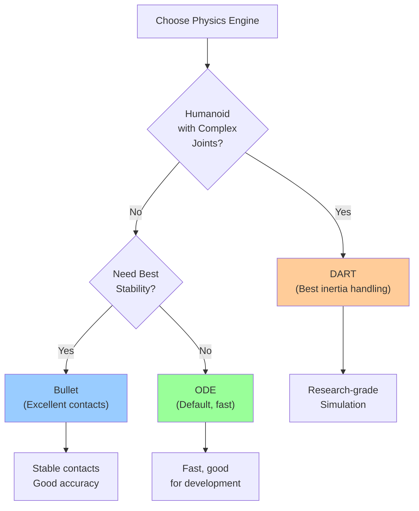

# Chapter 2: Gazebo Physics Engine

## How Physics Engines Work

A **physics engine** is software that simulates how objects move and interact in a virtual world. In Gazebo, the physics engine calculates:

- **Gravity**: How fast objects fall
- **Collisions**: When objects bump into each other
- **Friction**: How much objects slide on surfaces
- **Contact forces**: How hard surfaces push back on objects

Without a physics engine, a robot in simulation would just hang in mid-air. With it, the robot falls realistically, stands on the ground, and interacts properly with objects.

## Physics Engines in Gazebo

Gazebo supports multiple physics engines:

| Engine | Speed | Accuracy | Use Case |
|--------|-------|----------|----------|
| **ODE** | Fast | Good | Default, general robotics |
| **Bullet** | Fast | Very Good | Better stability, contacts |
| **DART** | Slower | Excellent | Research, humanoids (best inertia handling) |
| **Ignition Physics** | Very Fast | Good | Ignition Gazebo (next-gen) |

For most robotics, **ODE** or **Bullet** are excellent choices. **DART** is best if your humanoid has complex joint interactions.

### Physics Engine Comparison Diagram



## Core Physics Parameters

Let's understand the main settings that affect how simulation behaves:

### Gravity

```
Gravity on Earth: 9.81 m/s²

In Gazebo world file:
<gravity x="0" y="0" z="-9.81"/>

What this means:
- Negative Z means "down"
- Value -9.81 means standard Earth gravity
- Change to -4.9 for half-gravity, -0 for no gravity
```

**Why change gravity?**
- Test robot on Moon (-1.6 m/s²)
- Test on Mars (-3.7 m/s²)
- Slow-motion testing (reduce gravity)
- Exaggerate effects (increase gravity)

### Mass and Inertia

Every object has **mass** (how heavy) and **inertia** (resistance to rotation):

```
<link name="gripper">
  <inertial>
    <mass>2.5</mass>  <!-- 2.5 kg -->
    <inertia>
      <!-- Defines how hard it is to rotate around each axis -->
      <ixx>0.01</ixx>  <!-- Around X axis -->
      <iyy>0.01</iyy>  <!-- Around Y axis -->
      <izz>0.01</izz>  <!-- Around Z axis -->
    </inertia>
  </inertial>
</link>
```

**Critical for realism**: Inertia must match the actual object's shape. A long, thin object spins easily around its length but resists spinning around its width.

### Friction Models

Friction determines how much objects slide on surfaces:

```
Low Friction (ice):
- Objects slide easily
- Robot feet slip
- Unstable standing

High Friction (rubber on concrete):
- Objects grip well
- Robot feet stable
- Realistic traction
```

Configure in SDF:
```
<surface>
  <friction>
    <mu>0.5</mu>    <!-- Coefficient of friction (higher = more grip) -->
    <mu2>0.5</mu2>  <!-- Friction in other direction -->
  </friction>
</surface>
```

### Physics Timestep

The physics engine calculates motion in discrete **timesteps**:

```
Timestep = 0.001 seconds (1 millisecond)

At each timestep:
1. Apply forces (gravity, motors)
2. Detect collisions
3. Resolve contacts
4. Update positions

Smaller timestep → More accurate but slower
Larger timestep → Faster but less accurate
```

**Typical values**:
- **0.001** (1ms): High accuracy, slower simulation
- **0.004** (4ms): Good balance (ROS 2 control loops usually 1-10ms)
- **0.01** (10ms): Lower accuracy, faster

## Realistic Simulation: Configuration Example

Let's walk through configuring a realistic simulation for a humanoid robot:

### Step 1: Set Gravity

```xml
<world name="default">
  <gravity x="0" y="0" z="-9.81"/>
  <physics name="default_physics" default="0" type="ode">
    <max_step_size>0.001</max_step_size>
    <real_time_factor>1.0</real_time_factor>
  </physics>
</world>
```

### Step 2: Configure Contact Solver

How Gazebo resolves collisions:

```xml
<physics>
  <ode>
    <solver>
      <type>quick</type>  <!-- faster but less accurate -->
      <iters>50</iters>   <!-- iterations per step (higher = more accurate) -->
    </solver>
    <constraints>
      <cfm>0</cfm>        <!-- Contact constraint softness -->
      <erp>0.2</erp>      <!-- Error reduction parameter -->
    </constraints>
  </ode>
</physics>
```

### Step 3: Define Floor Friction

```xml
<model name="ground_plane">
  <link name="link">
    <collision name="collision">
      <geometry>
        <plane><normal>0 0 1</normal></plane>
      </geometry>
      <surface>
        <friction>
          <mu>1.0</mu>    <!-- Concrete floor -->
          <mu2>1.0</mu2>
        </friction>
        <contact>
          <max_vel>0.1</max_vel>
          <min_depth>0.001</min_depth>
        </contact>
      </surface>
    </collision>
  </link>
</model>
```

### Step 4: Configure Robot (URDF)

Load your robot with correct mass and inertia:

```xml
<link name="torso">
  <inertial>
    <mass>15.0</mass>  <!-- Humanoid torso mass -->
    <inertia>
      <ixx>0.5</ixx>
      <iyy>0.5</iyy>
      <izz>0.4</izz>
    </inertia>
  </inertial>
  <collision>
    <geometry>
      <box size="0.3 0.3 0.5"/>  <!-- Collision shape -->
    </geometry>
  </collision>
</link>
```

## Common Physics Issues and Solutions

### Problem 1: Robot Falls Through Floor

**Symptom**: In Gazebo, robot sinks into ground instead of standing

**Causes**:
- Collision geometry not defined for robot
- Floor friction too low
- Physics timestep too large

**Solution**:
```xml
<!-- Add collision to robot links -->
<collision name="collision">
  <geometry>
    <box size="..."/>
  </geometry>
</collision>

<!-- Increase floor friction -->
<mu>1.5</mu>

<!-- Reduce timestep -->
<max_step_size>0.001</max_step_size>
```

### Problem 2: Robot Vibrates or Explodes

**Symptom**: Robot shakes violently or parts fly apart

**Causes**:
- Physics timestep too large
- Contact stiffness too high
- Inertia values incorrect

**Solution**:
```xml
<!-- Reduce timestep -->
<max_step_size>0.0005</max_step_size>

<!-- Increase solver iterations -->
<iters>100</iters>

<!-- Soften contact (increase CFM) -->
<cfm>0.00001</cfm>
```

### Problem 3: Simulation Runs Slowly

**Symptom**: Real-time factor < 0.5 (simulation slower than real-time)

**Causes**:
- Too many objects/complexity
- Timestep too small
- Complex mesh collisions

**Solution**:
```xml
<!-- Increase timestep (less accurate but faster) -->
<max_step_size>0.002</max_step_size>

<!-- Use simpler collision geometries -->
<!-- Instead of: <mesh>complex_model.dae</mesh> -->
<!-- Use: <box size="0.5 0.3 0.2"/> -->

<!-- Reduce solver iterations -->
<iters>20</iters>
```

## Real-World Scenario: Humanoid Standing in Gazebo

Let's trace how physics makes a humanoid robot stand realistically:

### Initial State
Robot is dropped into simulation at time t=0

### Physics Calculation
At each timestep (1ms):
1. **Gravity acts**: Robot falls downward
2. **Feet collide with floor**: Physics engine detects collision
3. **Contact force calculated**: Normal force equals robot weight
4. **Friction applied**: Friction force prevents feet from sliding
5. **Robot accelerates upward**: Collision stops falling
6. **Result**: Robot oscillates until resting on floor

### Realistic Outcome
```
Time 0.0s: Robot dropped
Time 0.1s: Robot has fallen 0.05m (gravity accelerating it)
Time 0.2s: Robot feet touch floor (collision detected)
Time 0.25s: Robot stops sinking (equilibrium reached)
Time 0.3s: Robot slightly compressed, stabilizes
Time 0.5s: Robot standing stably on floor
```

### Unrealistic Scenario (Common Error)
If inertia is wrong:
```
Time 0.0s: Robot dropped
Time 0.2s: Robot falls through floor (no collision)
Result: FAIL - robot disappears!
```

**Solution**: Check URDF has correct collision geometry and inertia values.

## Tuning Physics for Your Robot

Here's a systematic approach:

### Step 1: Start with Defaults
```xml
<max_step_size>0.001</max_step_size>
<real_time_factor>1.0</real_time_factor>
<iters>50</iters>
```

### Step 2: Test Basic Stability
1. Drop robot in Gazebo
2. Does it stand without falling through floor?
3. If yes → proceed
4. If no → check collision geometry

### Step 3: Test Friction
1. Apply small horizontal force to robot
2. Does it slip or resist?
3. Adjust `<mu>` until behavior matches real robot

### Step 4: Test Motion
1. Command robot to walk
2. Does it maintain balance?
3. Does it recover from small pushes?
4. Adjust inertia if wobbly

### Step 5: Performance Tuning
1. Check real-time factor
2. If < 0.8 → increase timestep or simplify world
3. If > 1.0 and shaky → decrease timestep

## Cross-Module Connections

Physics simulation enables multiple downstream capabilities:

**From Module 1 (ROS 2 Fundamentals)**:
- **URDF files** (Module 1, Chapter 3) define robot mass and inertia used by physics engine
- **ROS 2 topics** (Module 1, Chapter 1) publish sensor readings generated by physics simulation
- **Autonomous agents** (Module 1, Chapter 2) receive physics-based feedback for decision-making

**To Module 3 (Isaac Sim & Perception)**:
- Physics accuracy determines **sensor simulation realism** (Chapter 4 here)
- Learned perception models from Chapter 4's synthetic data depend on accurate physics
- **VSLAM and navigation** in Module 3 require realistic robot dynamics

**To Module 4 (VLA Pipeline)**:
- **Manipulation tasks** in Module 4 depend on accurate **friction and contact forces** (this chapter)
- **Grasping strategies** must account for physics parameters: mass, inertia, friction
- **Motion constraints** learned in simulation must match real robot physics

## SDF Format: World Files

Gazebo worlds are described in **SDF (Simulation Description Format)**:

```xml
<?xml version='1.0'?>
<sdf version='1.7'>
  <world name='default'>
    <!-- Gravity configuration -->
    <gravity x='0' y='0' z='-9.81'/>

    <!-- Physics engine -->
    <physics name='default_physics' default='0' type='ode'>
      <max_step_size>0.001</max_step_size>
      <real_time_factor>1.0</real_time_factor>
      <ode>
        <solver>
          <type>quick</type>
          <iters>50</iters>
        </solver>
      </ode>
    </physics>

    <!-- Models in world -->
    <model name='ground_plane'>
      <!-- ... collision, friction, etc ... -->
    </model>

    <include>
      <uri>model://my_robot</uri>
      <pose>0 0 0 0 0 0</pose>
    </include>
  </world>
</sdf>
```

## Key Takeaways

✓ **Physics engines** simulate gravity, collisions, friction realistically
✓ **Gazebo supports** ODE, Bullet, DART engines (choose based on needs)
✓ **Configuration matters**: Gravity, mass, inertia, friction affect realism
✓ **Timestep trade-off**: Smaller = more accurate but slower
✓ **Common issues**: Robot sinking, vibrating, running slowly (solutions provided)
✓ **SDF files** describe worlds in XML format
✓ **Tuning is iterative**: Test, observe, adjust parameters

## Acronym Reference

| Acronym | Full Name | Definition |
|---------|-----------|------------|
| **ODE** | Open Dynamics Engine | Open-source physics engine optimized for real-time robotics |
| **Bullet** | Bullet Physics Engine | High-performance physics engine with excellent contact handling |
| **DART** | Dynamic Animation and Robotics Toolkit | Research physics engine with superior humanoid inertia handling |
| **Ignition** | Ignition Gazebo | Next-generation Gazebo with high-performance physics backend |
| **Physics** | Physical Simulation | Computational modeling of real-world forces and interactions |
| **GPU** | Graphics Processing Unit | Specialized hardware for accelerating physics calculations |
| **CPU** | Central Processing Unit | Main processor for general physics simulation |
| **Friction** | Surface Resistance | Force opposing relative motion between surfaces (coefficient μ) |
| **Inertia** | Rotational Resistance | Resistance to angular acceleration around each axis |
| **Contact** | Collision Response | Forces generated when objects collide in simulation |

## Next: Chapter 3

Now that you understand physics, let's **build realistic worlds**. In **Chapter 3: Building Custom Worlds**, you'll create Gazebo environments with obstacles, objects, and varying terrain for your robot to navigate.

---

**Learning Outcome**: You can now configure realistic physics in Gazebo, understand the trade-offs between accuracy and speed, and troubleshoot common physics simulation problems.
