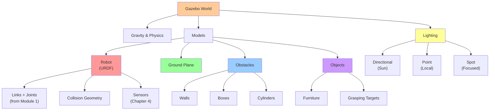

# Chapter 3: Building Custom Worlds

## What is a Gazebo World?

A **Gazebo world** is a 3D environment containing:
- **Models**: Objects in the world (robots, furniture, obstacles)
- **Physics**: Gravity, surfaces, collision properties
- **Lighting**: Light sources that affect visibility
- **Terrain**: Ground plane, ramps, walls

Building custom worlds is how you simulate different scenarios your robot needs to handle.

## Starting from Scratch: Creating a World File

A minimal Gazebo world looks like this:

```xml
<?xml version="1.0"?>
<sdf version="1.7">
  <world name="my_world">
    <!-- Gravity -->
    <gravity x="0" y="0" z="-9.81"/>

    <!-- Physics -->
    <physics name="default_physics" default="true" type="ode">
      <max_step_size>0.001</max_step_size>
    </physics>

    <!-- Sun (light source) -->
    <light name="sun" type="directional">
      <direction>1 1 1</direction>
      <diffuse>1 1 1 1</diffuse>
      <specular>.5 .5 .5 1</specular>
    </light>

    <!-- Ground plane -->
    <model name="ground_plane">
      <static>true</static>
      <link name="link">
        <collision name="collision">
          <geometry>
            <plane>
              <normal>0 0 1</normal>
            </plane>
          </geometry>
        </collision>
        <visual name="visual">
          <geometry>
            <plane>
              <normal>0 0 1</normal>
              <size>100 100</size>
            </plane>
          </geometry>
          <material>
            <ambient>0.8 0.8 0.8 1</ambient>
            <diffuse>0.8 0.8 0.8 1</diffuse>
          </material>
        </visual>
      </link>
    </model>
  </world>
</sdf>
```

Save this as `my_world.sdf` and open in Gazebo!

## Adding Models to Your World

Models are objects (robots, furniture, obstacles). There are three ways to add them:

### Method 1: Include from Gazebo Model Database

```xml
<include>
  <uri>model://unit_box</uri>
  <name>box1</name>
  <pose>1 2 0.5 0 0 0</pose>
</include>

<include>
  <uri>model://wood_table</uri>
  <pose>5 5 0 0 0 0</pose>
</include>

<include>
  <uri>model://my_robot</uri>
  <pose>0 0 0.5 0 0 0</pose>
</include>
```

**Available models** in Gazebo:
- `unit_box`, `unit_cylinder`, `unit_sphere` (primitive shapes)
- `ground_plane` (flat surface)
- `gas_cylinder` (obstacles)
- `wood_table`, `wood_chair` (furniture)
- Many more in the [Gazebo model database](https://app.ignitionrobotics.org/dashboard)

### Method 2: Define Custom Model Inline

```xml
<model name="obstacle_box">
  <pose>3 3 0.5 0 0 0</pose>
  <link name="link">
    <inertial>
      <mass>10</mass>
      <inertia>
        <ixx>0.1</ixx>
        <iyy>0.1</iyy>
        <izz>0.1</izz>
      </inertia>
    </inertial>
    <collision name="collision">
      <geometry>
        <box>
          <size>1 1 1</size>
        </box>
      </geometry>
    </collision>
    <visual name="visual">
      <geometry>
        <box>
          <size>1 1 1</size>
        </box>
      </geometry>
      <material>
        <ambient>1 0 0 1</ambient>
      </material>
    </visual>
  </link>
</model>
```

### Method 3: Reference from External Model File

Create separate model file (`models/my_chair/model.sdf`):
```xml
<?xml version="1.0"?>
<sdf version="1.7">
  <model name="my_chair">
    <link name="seat">
      <!-- ... -->
    </link>
    <link name="leg1">
      <!-- ... -->
    </link>
  </model>
</sdf>
```

Then include in world:
```xml
<include>
  <uri>file:///path/to/models/my_chair</uri>
  <pose>2 2 0 0 0 0</pose>
</include>
```

## Real-World Scenario: Office Environment

Let's build an office world for a robot to navigate:

```xml
<?xml version="1.0"?>
<sdf version="1.7">
  <world name="office">
    <gravity x="0" y="0" z="-9.81"/>
    <physics name="default_physics" default="true" type="ode">
      <max_step_size>0.001</max_step_size>
    </physics>

    <!-- Light -->
    <light name="sun" type="directional">
      <direction>1 1 1</direction>
    </light>

    <!-- Ground -->
    <model name="ground_plane">
      <static>true</static>
      <link name="link">
        <collision name="collision">
          <geometry>
            <plane/>
          </geometry>
        </collision>
        <visual name="visual">
          <geometry>
            <plane>
              <size>20 20</size>
            </plane>
          </geometry>
          <material>
            <ambient>0.8 0.8 0.8 1</ambient>
          </material>
        </visual>
      </link>
    </model>

    <!-- North Wall (obstacle) -->
    <model name="north_wall">
      <static>true</static>
      <pose>0 10 1 0 0 0</pose>
      <link name="link">
        <collision name="collision">
          <geometry>
            <box>
              <size>20 0.2 2</size>
            </box>
          </geometry>
        </collision>
        <visual name="visual">
          <geometry>
            <box>
              <size>20 0.2 2</size>
            </box>
          </geometry>
          <material>
            <ambient>0.5 0.5 0.5 1</ambient>
          </material>
        </visual>
      </link>
    </model>

    <!-- South Wall -->
    <model name="south_wall">
      <static>true</static>
      <pose>0 -10 1 0 0 0</pose>
      <link name="link">
        <collision name="collision">
          <geometry>
            <box>
              <size>20 0.2 2</size>
            </box>
          </geometry>
        </collision>
        <visual name="visual">
          <geometry>
            <box>
              <size>20 0.2 2</size>
            </box>
          </geometry>
          <material>
            <ambient>0.5 0.5 0.5 1</ambient>
          </material>
        </visual>
      </link>
    </model>

    <!-- Table -->
    <include>
      <uri>model://wood_table</uri>
      <pose>5 5 0 0 0 0</pose>
    </include>

    <!-- Obstacles (boxes) -->
    <include>
      <uri>model://unit_box</uri>
      <name>obstacle_1</name>
      <pose>-5 0 0.5 0 0 0</pose>
    </include>

    <include>
      <uri>model://unit_box</uri>
      <name>obstacle_2</name>
      <pose>3 -5 0.5 0 0 0</pose>
    </include>

    <!-- Robot -->
    <include>
      <uri>model://my_humanoid_robot</uri>
      <pose>0 0 0.9 0 0 0</pose>
    </include>
  </world>
</sdf>
```

**Result**: Office with walls, table, obstacles, and your robot!

## Coordinate System and Positioning

In Gazebo, the coordinate system is:
- **X-axis**: Forward/backward (red in RViz)
- **Y-axis**: Left/right (green in RViz)
- **Z-axis**: Up/down (blue in RViz)

**Pose format**: `<pose>x y z roll pitch yaw</pose>`

Examples:
```xml
<!-- Robot at origin, standing upright -->
<pose>0 0 0.9 0 0 0</pose>

<!-- Box 5 meters forward, 3 meters right, 0.5 meters up -->
<pose>5 3 0.5 0 0 0</pose>

<!-- Tilted 45 degrees around X-axis -->
<pose>0 0 1 1.57 0 0</pose>  <!-- 1.57 rad = 90 degrees -->

<!-- Rotated 180 degrees around Z-axis (facing opposite direction) -->
<pose>0 0 0 0 0 3.14</pose>  <!-- 3.14 rad = 180 degrees -->
```

### World Structure Hierarchy Diagram



## Common World Scenarios

### Warehouse Scenario

```
Models: Shelves, boxes, cart, robot
Layout: Long aisles with obstacles
Robot task: Pick and place items
```

### Household Scenario

```
Models: Furniture, doors, kitchen, bedroom
Layout: Multi-room house
Robot task: Navigate and clean
```

### Outdoor Scenario

```
Models: Trees, grass, rocks, ramps
Layout: Uneven terrain
Robot task: Navigate rough terrain
```

## Lighting and Visibility

Lighting affects how sensors "see" the world:

### Bright Lighting (daytime)
```xml
<light name="sun" type="directional">
  <direction>0.5 0.5 1</direction>
  <diffuse>1 1 1 1</diffuse>
  <specular>0.8 0.8 0.8 1</specular>
</light>
```

### Dark Lighting (nighttime)
```xml
<light name="moon" type="directional">
  <direction>-0.5 -0.5 1</direction>
  <diffuse>0.2 0.2 0.2 1</diffuse>
  <specular>0.1 0.1 0.1 1</specular>
</light>
```

### Multiple Light Sources
```xml
<light name="sun" type="directional">
  <direction>1 1 1</direction>
</light>

<light name="spotlight" type="spot">
  <pose>5 5 5 0 0 0</pose>
  <diffuse>1 1 1 1</diffuse>
  <range>10</range>
  <spot>
    <inner_angle>0.3</inner_angle>
    <outer_angle>1</outer_angle>
  </spot>
</light>
```

**Why lighting matters**: Cameras and LiDAR behave differently under different lighting (shadows, reflections).

## Complex Geometries: Using Mesh Models

For complex shapes, use 3D mesh files:

```xml
<model name="complex_furniture">
  <link name="link">
    <collision name="collision">
      <geometry>
        <mesh>
          <uri>file:///path/to/model.dae</uri>
          <scale>1 1 1</scale>
        </mesh>
      </geometry>
    </collision>
    <visual name="visual">
      <geometry>
        <mesh>
          <uri>file:///path/to/model.dae</uri>
          <scale>1 1 1</scale>
        </mesh>
      </geometry>
    </visual>
  </link>
</model>
```

**File formats**: `.dae`, `.obj`, `.stl`

**Performance trade-off**: Meshes look detailed but are slower to simulate. Use simple collision shapes with textured visual meshes for best results.

## World Templates for Different Scenarios

### Empty World (Testing)
```xml
<!-- Just ground plane and robot -->
<model name="ground_plane">...</model>
<include>
  <uri>model://my_robot</uri>
</include>
```

### Simple Office
```xml
<!-- Walls, table, a few obstacles -->
<model name="walls">...</model>
<include>
  <uri>model://wood_table</uri>
</include>
<include>
  <uri>model://unit_box</uri>
</include>
```

### Warehouse
```xml
<!-- Shelves, racks, boxes, items -->
<model name="warehouse_rack">...</model>
<!-- Multiple rack models -->
<!-- Multiple box models as obstacles -->
```

### Outdoor
```xml
<!-- Terrain, trees, rocks -->
<model name="terrain">...</model>
<include>
  <uri>model://tree</uri>
</include>
```

## Cross-Module Connections

World building enables comprehensive simulation across modules:

**From Module 1 (ROS 2 Fundamentals)**:
- **URDF robots** (Module 1, Chapter 3) are placed in Gazebo worlds
- **ROS 2 node communication** (Module 1, Chapter 1) occurs within simulated worlds
- **Autonomous agents** (Module 1, Chapter 2) navigate constructed environments

**To Module 3 (Isaac Sim & Perception)**:
- **World structure** determines sensor data diversity for perception training
- **Terrain variation** (Chapter 3 here) teaches robots to handle varied environments
- **Isaac Sim environments** (Module 3) will build on Gazebo world templates

**To Module 4 (VLA Pipeline)**:
- **Object-centric worlds** enable manipulation task simulation
- **Semantic scene understanding** requires diverse, well-structured environments
- **Language grounding** in Module 4 maps robot actions to world structure

## Reusable World Structure

Best practice: Organize your worlds like this:

```
gazebo_worlds/
├── worlds/
│   ├── empty.world
│   ├── office.world
│   ├── warehouse.world
│   └── outdoor.world
├── models/
│   ├── my_robot/
│   │   ├── model.sdf
│   │   └── meshes/
│   ├── custom_obstacle/
│   │   └── model.sdf
│   └── ...
└── launch/
    ├── office.launch.py
    ├── warehouse.launch.py
    └── ...
```

Then launch with:
```bash
gazebo --verbose worlds/office.world
```

## Key Takeaways

✓ **Gazebo worlds** are XML files describing 3D environments
✓ **Models** can be included from database or defined custom
✓ **Pose format**: `<pose>x y z roll pitch yaw</pose>`
✓ **Coordinate system**: X (forward), Y (right), Z (up)
✓ **Lighting** affects sensor perception (important for chapter 4!)
✓ **Meshes** provide detail but cost performance
✓ **Reusable templates** save time for multiple scenarios

## Acronym Reference

| Acronym | Full Name | Definition |
|---------|-----------|------------|
| **SDF** | Simulation Description Format | XML format for describing Gazebo worlds, models, and physics |
| **XML** | eXtensible Markup Language | Standard format for storing hierarchical structured data |
| **Model** | Gazebo Model | A collection of links, joints, and sensors representing an object |
| **Link** | Rigid Body | A single rigid body within a model (mass, collision, visual) |
| **Joint** | Connection | Mechanical connection between two links with degrees of freedom |
| **Gravity** | Gravitational Acceleration | Force pulling objects downward (default: -9.81 m/s²) |
| **Physics** | Physics Simulation | Computational engine calculating forces and motion |
| **Lighting** | Light Sources | Directional, point, or spot lights affecting visibility |
| **Terrain** | Environment Surface | Ground plane, ramps, hills, and landscape features |
| **Asset** | 3D Model Resource | Mesh files, textures, and visual components (.dae, .obj, .stl) |

## Next: Chapter 4

Now your robots can stand in realistic worlds. But how do they **perceive** those worlds? In **Chapter 4: Sensor Simulation**, you'll attach cameras, LiDAR, and IMU sensors to measure what's happening in your simulated world.

---

**Learning Outcome**: You can now create custom Gazebo worlds with obstacles, lighting, and multiple models. You can organize reusable world templates for different scenarios.
