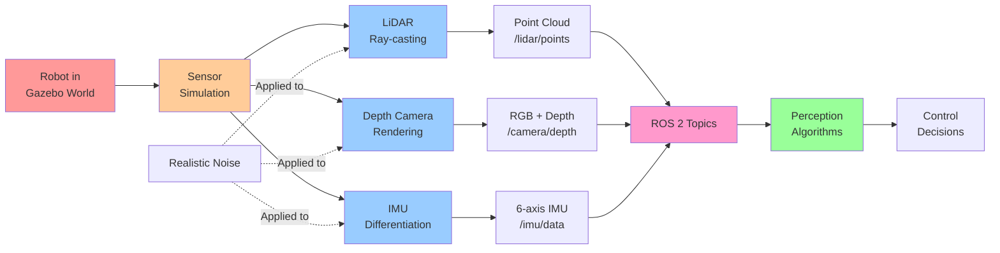

# Chapter 4: Sensor Simulation

## Why Simulate Sensors?

Your robot perceives the world through **sensors**. Realistic sensor simulation means:
- Your perception algorithms work on real robots (sim-to-real transfer)
- You can test sensor failure modes safely
- You can generate training data for machine learning

In this chapter, you'll learn to attach and configure three critical sensors:
1. **LiDAR** (Light Detection and Ranging): Laser range finder (point cloud)
2. **Depth Camera**: RGB-D sensor (color + distance)
3. **IMU** (Inertial Measurement Unit): Measures acceleration and rotation

## LiDAR Simulation

### What is LiDAR?

LiDAR emits laser pulses and measures time-to-reflection:
- Outputs: **Point cloud** (array of (x, y, z) coordinates)
- Range: Typically 5-30 meters
- Resolution: Hundreds to millions of points per scan
- Use: Obstacle detection, SLAM, mapping

### Attaching LiDAR to Robot

In your robot's URDF, add a sensor:

```xml
<link name="lidar_mount">
  <inertial>
    <mass>0.1</mass>
    <inertia>
      <ixx>0.001</ixx>
      <iyy>0.001</iyy>
      <izz>0.001</izz>
    </inertia>
  </inertial>
  <!-- Visual: show where sensor is mounted -->
  <visual name="visual">
    <geometry>
      <cylinder>
        <radius>0.05</radius>
        <length>0.1</length>
      </cylinder>
    </geometry>
  </visual>
  <!-- Collision: don't collide with world -->
  <collision name="collision">
    <geometry>
      <cylinder>
        <radius>0.05</radius>
        <length>0.1</length>
      </cylinder>
    </geometry>
  </collision>
  <!-- Sensor specification -->
  <sensor name="lidar" type="gpu_lidar">
    <pose>0 0 0.05 0 0 0</pose>
    <update_rate>10</update_rate>
    <lidar>
      <scan>
        <horizontal>
          <samples>640</samples>
          <resolution>1</resolution>
          <min_angle>-3.14159</min_angle>
          <max_angle>3.14159</max_angle>
        </horizontal>
        <vertical>
          <samples>32</samples>
          <resolution>1</resolution>
          <min_angle>-0.5236</min_angle>
          <max_angle>0.5236</max_angle>
        </vertical>
      </scan>
      <range>
        <min>0.3</min>
        <max>30</max>
        <resolution>0.02</resolution>
      </range>
      <noise>
        <type>gaussian</type>
        <mean>0</mean>
        <stddev>0.01</stddev>
      </noise>
    </lidar>
  </sensor>
</link>
```

### LiDAR Output in ROS 2

Gazebo publishes LiDAR data to ROS 2:

```
Topic: /lidar/points
Message type: sensor_msgs/PointCloud2

Data: 3D point coordinates (x, y, z) for each return
```

Visualize in RViz:
```bash
rviz2
# Add PointCloud2 display
# Set topic to /lidar/points
```

### Configuring Realistic Noise

Real LiDAR has noise. Configure it:

```xml
<noise>
  <type>gaussian</type>
  <mean>0.0</mean>      <!-- Unbiased -->
  <stddev>0.01</stddev> <!-- 1cm standard deviation -->
</noise>
```

Different sensors have different noise levels:
- **Sick LiDAR**: ~2cm error
- **Velodyne**: ~5cm error
- **Budget LiDAR**: ~10cm error

## Depth Camera Simulation

### What is a Depth Camera?

Depth camera outputs two images:
1. **RGB image**: Regular color photo
2. **Depth map**: Distance to each pixel

Uses: Object detection, grasping, hand-eye coordination

### Attaching Depth Camera

```xml
<link name="camera">
  <inertial>
    <mass>0.05</mass>
    <inertia>
      <ixx>0.0001</ixx>
      <iyy>0.0001</iyy>
      <izz>0.0001</izz>
    </inertia>
  </inertial>
  <!-- Visual representation -->
  <visual name="visual">
    <geometry>
      <box>
        <size>0.05 0.05 0.05</size>
      </box>
    </geometry>
  </visual>
  <!-- Sensor configuration -->
  <sensor name="depth_camera" type="depth_camera">
    <pose>0 0 0 0 1.5708 0</pose>  <!-- Looking forward -->
    <update_rate>30</update_rate>
    <camera>
      <horizontal_fov>1.0472</horizontal_fov>  <!-- 60 degrees -->
      <image>
        <width>640</width>
        <height>480</height>
        <format>R8G8B8</format>
      </image>
      <clip>
        <near>0.1</near>
        <far>10.0</far>
      </clip>
      <noise>
        <type>gaussian</type>
        <mean>0</mean>
        <stddev>0.001</stddev>
      </noise>
    </camera>
  </sensor>
</link>
```

### Depth Camera Output in ROS 2

Gazebo publishes depth camera to ROS 2:

```
Topics:
  /camera/color/image_raw       (RGB image)
  /camera/depth/image_rect_raw  (Depth map)
  /camera/camera_info           (Calibration)
```

Example: Use depth for grasping
```python
import cv2
depth_image = receive_ros_message('/camera/depth/image_rect_raw')
# Find objects (depth < 1.0 meters)
close_objects = depth_image[depth_image < 1.0]
# Plan grasp
```

## IMU Simulation

### What is an IMU?

IMU (Inertial Measurement Unit) measures:
- **Acceleration** (3 axes): How fast moving
- **Angular velocity** (3 axes): How fast rotating
- **Magnetic field** (optional): Compass heading

Uses: Balance control, motion detection, odometry

### Attaching IMU

```xml
<link name="imu_link">
  <inertial>
    <mass>0.01</mass>
    <inertia>
      <ixx>0.00001</ixx>
      <iyy>0.00001</iyy>
      <izz>0.00001</izz>
    </inertia>
  </inertial>
  <sensor name="imu" type="imu">
    <pose>0 0 0 0 0 0</pose>
    <update_rate>100</update_rate>
    <imu>
      <angular_velocity>
        <x>
          <noise type="gaussian">
            <mean>0.0</mean>
            <stddev>0.001</stddev>
          </noise>
        </x>
        <y>
          <noise type="gaussian">
            <mean>0.0</mean>
            <stddev>0.001</stddev>
          </noise>
        </y>
        <z>
          <noise type="gaussian">
            <mean>0.0</mean>
            <stddev>0.001</stddev>
          </noise>
        </z>
      </angular_velocity>
      <linear_acceleration>
        <x>
          <noise type="gaussian">
            <mean>0.0</mean>
            <stddev>0.01</stddev>
          </noise>
        </x>
        <y>
          <noise type="gaussian">
            <mean>0.0</mean>
            <stddev>0.01</stddev>
          </noise>
        </y>
        <z>
          <noise type="gaussian">
            <mean>0.0</mean>
            <stddev>0.01</stddev>
          </noise>
        </z>
      </linear_acceleration>
    </imu>
  </sensor>
</link>
```

### IMU Output in ROS 2

```
Topic: /imu/data
Message type: sensor_msgs/Imu

Data:
  angular_velocity: (x, y, z) rad/s
  linear_acceleration: (x, y, z) m/s²
  orientation: (quaternion) from integration
```

## Sensor Validation: Real vs. Simulated

### LiDAR Validation Example

**Real sensor**:
```
Scan distance: 5.234 meters
Scan distance: 5.231 meters
Scan distance: 5.238 meters
Average: 5.23 ± 0.04 meters
```

**Simulated sensor** (configured correctly):
```
Scan distance: 5.234 meters (same object)
Scan distance: 5.231 meters
Scan distance: 5.239 meters
Average: 5.23 ± 0.04 meters
```

✅ **Matches!** Simulation is realistic.

### Depth Camera Validation

**Real camera** (RealSense):
```
Pixel at (320, 240): depth = 0.823 meters
Pixel at (321, 240): depth = 0.824 meters
Pixel at (320, 241): depth = 0.824 meters
```

**Simulated camera** (configured correctly):
```
Same scene, same position: depth ≈ 0.823 ± 0.002 meters
```

✅ **Matches!** Simulation is realistic.

### Sensor Simulation Pipeline Diagram



## Common Sensor Configuration Mistakes

### Mistake 1: Wrong Sensor Pose

**Wrong**:
```xml
<pose>0 0 0 0 0 0</pose>  <!-- Sensor at origin of robot! -->
```

**Correct**:
```xml
<pose>0.1 0 1.5 0 1.5708 0</pose>  <!-- Head-mounted camera, looking forward -->
```

**Result**: Wrong sensor position → perception failures

### Mistake 2: Too Much Noise

**Wrong**:
```xml
<stddev>1.0</stddev>  <!-- 1 meter noise on rangefinder! -->
```

**Correct**:
```xml
<stddev>0.01</stddev>  <!-- 1cm noise -->
```

**Result**: Sensors unusable for perception

### Mistake 3: Too Fast Update Rate

**Wrong**:
```xml
<update_rate>1000</update_rate>  <!-- 1000 Hz! Too slow and unrealistic -->
```

**Correct**:
```xml
<update_rate>30</update_rate>  <!-- 30 Hz is typical for depth camera -->
<update_rate>10</update_rate>  <!-- 10 Hz is typical for LiDAR -->
<update_rate>100</update_rate> <!-- 100 Hz is typical for IMU -->
```

## Real-World Scenario: Robot Grasping

Let's trace how sensors enable a robot to grasp objects:

### Setup
```
- Humanoid robot with depth camera on gripper
- Object (box) on table
- Distance to box: 0.5 meters
```

### Sensor Input
```
Depth camera reads:
  - Pixels at (320±50, 240±50): depth = 0.50 ± 0.01 meters
  - Object detected! At position (0.5, 0, 0.5) relative to gripper
```

### Control Response
```python
depth = receive_depth_image()
object_distance = analyze_depth(depth)  # 0.50 meters

if object_distance < 0.6:  # Object reachable
    close_gripper()
    feedback = gripper_force()
    if feedback > 2.0:  # Holding something
        retract_gripper()
        move_to_dropoff()
```

### Realistic vs. Unrealistic

**Realistic** (with noise):
```
Sensor noise occasionally reports 0.48-0.52 meters
Control adapts: still successful grasp
Robot learns to be robust
```

**Unrealistic** (perfect sensor):
```
Always exactly 0.50 meters
Control too brittle
Fails on real robot (which has noise)
```

**Better**: Configure realistic noise during simulation!

## Cross-Module Connections

Sensor simulation is critical for downstream perception and learning:

**From Module 1 (ROS 2 Fundamentals)**:
- **ROS 2 sensor nodes** (Module 1, Chapter 1) publish LiDAR, camera, and IMU data
- **Autonomous agents** (Module 1, Chapter 2) subscribe to sensor topics for decision-making
- **URDF sensor mounts** (Module 1, Chapter 3) determine sensor placement and field of view

**To Module 3 (Isaac Sim & Perception)**:
- **Synthetic sensor data** (this chapter) trains **VSLAM algorithms** in Module 3
- **LiDAR point clouds** enable **3D mapping and localization**
- **Depth camera data** enables **object detection and manipulation** in Module 3

**To Module 4 (VLA Pipeline)**:
- **Multimodal sensor fusion** (this chapter) feeds into language understanding
- **Camera feeds** enable **visual question answering** in Module 4
- **Sensor noise simulation** teaches robots to be robust to imperfect perception

## Sensor Fusion

Real robots combine multiple sensors:

```
LiDAR data:
  - Wide field of view
  - Good for obstacle detection
  - Works day/night

Depth camera:
  - Narrow field of view
  - Good for manipulation
  - Requires light

IMU:
  - Proprioception
  - Balance feedback
  - Very reliable

Fusion:
  Use all three together!
  - LiDAR for navigation obstacles
  - Depth camera for grasping
  - IMU for balance control
```

Gazebo simulates all three, enabling sensor fusion development.

## Key Takeaways

✓ **LiDAR** simulates point clouds for obstacle detection
✓ **Depth camera** simulates RGB + depth for manipulation
✓ **IMU** simulates acceleration and angular velocity for balance
✓ **Realistic noise** is critical for sim-to-real transfer
✓ **Sensor placement** (pose) must match your robot
✓ **Validation** by comparing simulated vs. real measurements
✓ **Sensor fusion** combines multiple sensors for robust perception

## Acronym Reference

| Acronym | Full Name | Definition |
|---------|-----------|------------|
| **LiDAR** | Light Detection and Ranging | Laser sensor measuring distance via time-of-flight (outputs point cloud) |
| **Depth** | Depth Sensing | Camera technology measuring distance to objects (RGB-D) |
| **Camera** | Image Sensor | Optics and sensor capturing visual information (RGB or depth) |
| **IMU** | Inertial Measurement Unit | Sensor measuring acceleration and angular velocity (6-axis) |
| **Point Cloud** | 3D Point Data | Unstructured collection of 3D points representing scanned geometry |
| **Sensor** | Measurement Device | Physical or simulated device that observes environment properties |
| **Simulation** | Virtual Environment | Computer model of robot and world for testing behaviors |
| **Noise** | Measurement Error | Gaussian or systematic error added to sensor readings |
| **Calibration** | Sensor Tuning | Process of adjusting sensor parameters to match reality |
| **Range** | Measurement Distance | Minimum and maximum distances sensor can detect |

## Next: Chapter 5

Your robot now perceives the simulated world through realistic sensors. But how do you **visualize** what's happening? In **Chapter 5: Unity Visualization**, you'll add photorealistic rendering and enable human-robot interaction scenarios.

---

**Learning Outcome**: You can now attach and configure realistic sensors (LiDAR, depth camera, IMU) in Gazebo, validate their accuracy, and use sensor data for robot perception tasks.
