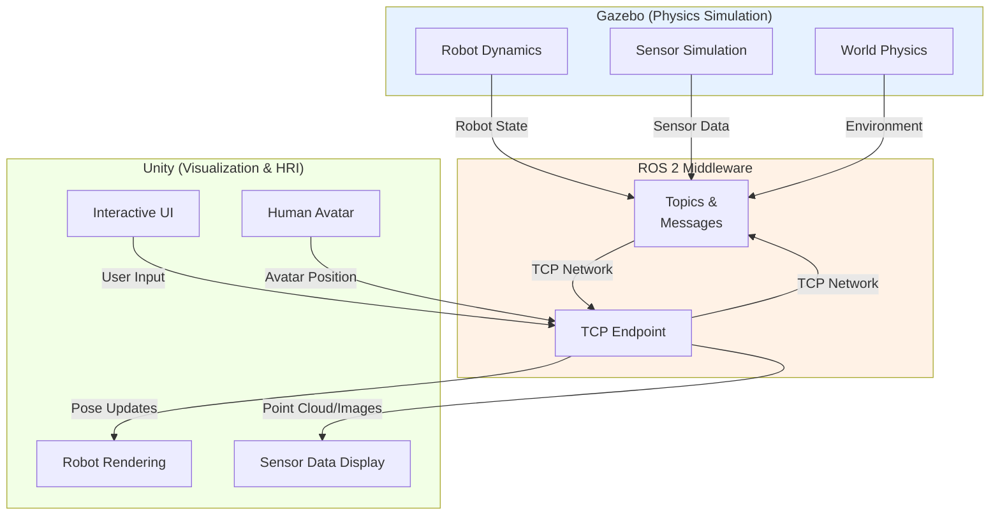

# Chapter 5: Unity Visualization & Human-Robot Interaction

## Why Add Unity to Gazebo?

Gazebo is excellent for physics but has basic graphics. Unity provides:

- **Photorealistic rendering**: Beautiful, realistic 3D environments
- **Human avatars**: Visualize humans interacting with robots
- **Debugging tools**: Overlay sensor data, motion planning, trajectories
- **Demonstrations**: Show stakeholders how robots work
- **HRI (Human-Robot Interaction)**: Simulate collaborative scenarios

**The hybrid approach**: Gazebo physics + Unity graphics = best of both worlds.

## How It Works: ROS 2 Bridge

A **ROS 2 bridge** connects Gazebo and Unity:

```
Gazebo                     ROS 2 Middleware              Unity
(Physics)                  (Communication)              (Graphics)
    ↓                              ↓                         ↓
Robot moves            →     /robot/state topic      →    Robot rendered
Sensors output         →     /sensor/data topics     →    Data visualized
User input (Unity)     ←     /command topics         ←    User clicks
```

### ROS 2 Bridge Options

| Bridge | Support | Setup |
|--------|---------|-------|
| **ROS-TCP-Connector** | All versions | Medium |
| **Unity Robotics Hub** | Modern | Easy |
| **LGSVL Simulator** | Advanced | Complex |

Most popular: **ROS-TCP-Connector**

### Gazebo-Unity Bridge Architecture Diagram



## Setting Up ROS 2 Bridge

### Step 1: Install Bridge Package

```bash
# On Linux (where Gazebo runs)
sudo apt install ros-humble-turtlebot3-gazebo
sudo apt install ros-humble-ros-tcp-endpoint
```

### Step 2: Start ROS 2 TCP Bridge

```bash
# Terminal 1: ROS 2 core
ros2 run ros_tcp_endpoint default_server_endpoint --ros-args -p ROS_DOMAIN_ID:=0

# Terminal 2: Gazebo
gazebo my_world.world

# Terminal 3: TCP bridge
ros2 launch ros_tcp_endpoint tcp_endpoint.launch.py
```

### Step 3: Configure Unity

In Unity:
1. Import ROS-TCP-Connector package
2. Create ROS Connector component
3. Set IP address: `localhost` (or IP of machine running ROS)
4. Set port: `10000` (default)

```csharp
using RosMessageTypes.Geometry;
using Unity.Robotics.ROSTCPConnector;
using Unity.Robotics.ROSTCPConnector.ROSGeometry;

public class RobotController : MonoBehaviour
{
    private ROSConnection ros;

    void Start()
    {
        ros = ROSConnection.GetOrCreateInstance();
        ros.Subscribe<PoseMsg>("/robot/pose", OnRobotPose);
    }

    void OnRobotPose(PoseMsg pose)
    {
        // Update robot position in Unity based on Gazebo pose
        transform.position = pose.position.As<Vector3>();
    }
}
```

## Visualizing Robot State in Unity

### Real-Time Pose Synchronization

Subscribe to robot position from Gazebo:

```csharp
ros.Subscribe<PoseMsg>("/robot/base_link/pose", UpdateRobotPose);

void UpdateRobotPose(PoseMsg pose)
{
    // Update Unity transform to match Gazebo pose
    transform.position = pose.position.As<Vector3>();
    transform.rotation = pose.orientation.As<Quaternion>();
}
```

**Result**: Robot in Unity moves exactly as it does in Gazebo, synchronized!

### Sensor Data Visualization

Visualize LiDAR data in Unity:

```csharp
ros.Subscribe<PointCloud2Msg>("/lidar/points", VisualizeLidar);

void VisualizeLidar(PointCloud2Msg cloud)
{
    // Extract point cloud data
    // Draw lines from robot to detected points
    // Color points by distance
    foreach (var point in cloud.data)
    {
        DrawDebugPoint(point, Color.red);
    }
}
```

Visualize depth camera in Unity:

```csharp
ros.Subscribe<ImageMsg>("/depth_camera/depth", VisualizeDepth);

void VisualizeDepth(ImageMsg depthImage)
{
    // Convert ROS image to Unity texture
    Texture2D depthTexture = depthImage.ToTexture2D();
    // Display on screen
    GetComponent<RawImage>().texture = depthTexture;
}
```

## Human-Robot Interaction (HRI) Scenarios

### Scenario 1: Human Avatar

Create a humanoid avatar controlled by keyboard:

```csharp
void Update()
{
    // Keyboard input
    float moveX = Input.GetAxis("Horizontal");
    float moveZ = Input.GetAxis("Vertical");

    // Move avatar
    Vector3 move = new Vector3(moveX, 0, moveZ) * speed;
    avatarTransform.Translate(move);

    // Publish human position to ROS
    PublishHumanPosition(avatarTransform.position);
}

void PublishHumanPosition(Vector3 pos)
{
    PoseMsg humanPose = new PoseMsg { position = pos.As<Vector3Msg>() };
    ros.Publish("human/pose", humanPose);
}
```

Now Gazebo knows human position → robot can react!

### Scenario 2: Interactive Demonstration

User clicks to place objects in Unity:

```csharp
void Update()
{
    if (Input.GetMouseButtonDown(0))
    {
        Ray ray = Camera.main.ScreenPointToRay(Input.mousePosition);
        if (Physics.Raycast(ray, out RaycastHit hit))
        {
            Vector3 clickPos = hit.point;
            // Publish goal position to ROS
            PublishGoal(clickPos);
        }
    }
}

void PublishGoal(Vector3 goal)
{
    GoalMsg goalMsg = new GoalMsg { position = goal.As<Vector3Msg>() };
    ros.Publish("robot/goal", goalMsg);
    // Gazebo's motion planner receives this goal and plans a path
}
```

### Scenario 3: Handshake

Simulate human-robot handshake:

```csharp
// Detect when robot hand reaches human hand
if (Vector3.Distance(robotHand.position, humanHand.position) < 0.1f)
{
    // Trigger handshake animation
    PlayHandshakeAnimation();

    // Log to metrics
    LogInteraction("handshake_successful");
}
```

## Advanced Visualization: Motion Planning

Visualize planned trajectories in Unity:

```csharp
ros.Subscribe<PathMsg>("/robot/planned_path", VisualizePath);

void VisualizePath(PathMsg path)
{
    LineRenderer line = GetComponent<LineRenderer>();
    line.positionCount = path.poses.Length;

    for (int i = 0; i < path.poses.Length; i++)
    {
        Vector3 pos = path.poses[i].position.As<Vector3>();
        line.SetPosition(i, pos);
    }
}
```

**Result**: See the robot's planned path as a line in 3D space!

## Debugging Complex Behaviors

### Overlay Sensor Information

Display sensor data on screen:

```csharp
void OnGUI()
{
    GUI.Label(new Rect(10, 10, 300, 100),
        $"Robot Position: {robotPos}\n" +
        $"Nearest Obstacle: {nearestObstacle}m\n" +
        $"Battery: {batteryLevel}%\n" +
        $"Task: {currentTask}");
}
```

### Motion Analysis Tools

Record and playback motion:

```csharp
List<PoseMsg> recordedPoses = new List<PoseMsg>();
bool isRecording = false;

void RecordPose(PoseMsg pose)
{
    if (isRecording)
        recordedPoses.Add(pose);
}

void PlaybackRecording()
{
    foreach (PoseMsg pose in recordedPoses)
    {
        UpdateRobotPose(pose);
        yield return new WaitForSeconds(0.01f);  // Playback at ~100 Hz
    }
}
```

## Performance Considerations

### Latency: The Synchronization Challenge

Ideal: 0ms latency (instant synchronization)
Realistic: 10-100ms latency

```
Gazebo publishes pose at 1ms → ROS middleware 2ms → Unity receives 3ms
Total: ~3-5ms of latency (good!)

But if:
Gazebo publishes at 1ms → Network delay 50ms → ROS 2ms → Unity receives 53ms
Total: ~50ms of latency (noticeable)

Solution: Optimize network, reduce publish frequency, or accept latency
```

### Frame Rate Management

Keep both simulators running smoothly:

```csharp
// Unity: Target 60 FPS
Time.targetFrameRate = 60;

// Gazebo: Target real-time
// In Gazebo config: <real_time_factor>1.0</real_time_factor>

// ROS publish rate: Not too fast (network overhead)
// Typical: 10-30 Hz for visualization
```

## Deployment Scenarios

### Local Machine (Development)
```
Machine A: Gazebo + ROS 2
Machine A: Unity
Connection: localhost (0ms latency)
```

### Two Machines (Remote)
```
Machine A: Gazebo + ROS 2 (Linux)
Machine B: Unity (Windows/Mac)
Connection: Network (10-50ms latency)
Setup: ROS 2 discovery across network
```

### Cloud-Based
```
Cloud Server: Gazebo + ROS 2
Local Machine: Unity
Connection: Internet (50-200ms latency)
Risk: High latency may break real-time interaction
```

## Cross-Module Connections

Unity visualization completes the simulation-to-reality pipeline:

**From Module 1 (ROS 2 Fundamentals)**:
- **ROS 2 bridge** (this chapter) extends Module 1's communication concepts
- **Autonomous agents** (Module 1, Chapter 2) receive feedback from Unity HRI
- **URDF models** (Module 1, Chapter 3) are rendered with photorealistic graphics in Unity

**To Module 3 (Isaac Sim & Perception)**:
- **Photorealistic rendering** prepares robots for **visual perception tasks** in Module 3
- **Human avatars** (this chapter) enable **human-robot collaboration** testing
- **Motion visualization** validates **VSLAM and navigation** algorithms

**To Module 4 (VLA Pipeline)**:
- **HRI scenarios** (this chapter) demonstrate language-grounded manipulation
- **Interactive demonstrations** enable **task learning from visual feedback**
- **Real-time synchronization** bridges simulated and real robot execution

## Creating a Complete HRI Demonstration

### Step 1: Design Scenario

```
Scene: Office environment
- Humanoid robot
- Human avatar
- Table with objects
- Task: "Hand-over" interaction
```

### Step 2: Implement Robot Behavior (ROS)

```python
# ROS 2 node for robot control
def human_detected_callback(human_pose):
    # React to human presence
    move_towards_human()

    # Offer handshake
    extend_hand()
```

### Step 3: Implement HRI (Unity)

```csharp
// Human player controls avatar
// Avatar position published to ROS
// Robot reacts to human proximity
// Handshake animation triggers
```

### Step 4: Visualize and Debug

```
Real-time display:
- Robot position
- Human position
- Distance between them
- Sensor data overlay
- Planned motion path
```

## Key Takeaways

✓ **ROS 2 bridge** connects Gazebo (physics) to Unity (graphics)
✓ **Synchronization** keeps simulations aligned in real-time
✓ **HRI scenarios** require bidirectional communication
✓ **Latency** is manageable with good network design
✓ **Visualization** helps debug complex robot behaviors
✓ **Motion planning** can be visualized as trajectories
✓ **Demonstrations** can showcase robot capabilities to stakeholders

## Acronym Reference

| Acronym | Full Name | Definition |
|---------|-----------|------------|
| **Unity** | Unity Game Engine | Cross-platform 3D graphics engine for visualization and interactive content |
| **ROS 2** | Robot Operating System 2 | Middleware for robot communication and software integration (from Module 1) |
| **Bridge** | Communication Protocol | Software layer connecting two systems (Gazebo ↔ Unity via ROS 2 topics) |
| **TCP** | Transmission Control Protocol | Reliable network protocol for ROS 2 TCP connector |
| **Socket** | Network Connection | Endpoint for bidirectional communication over TCP/IP network |
| **Rendering** | Graphics Computation | Process of generating 3D images from scene data |
| **Photorealistic** | Physically-Based Rendering | High-fidelity graphics matching real-world appearance and lighting |
| **HRI** | Human-Robot Interaction | Study and simulation of how humans and robots interact collaboratively |
| **Avatar** | Virtual Character | Digital representation of a human for interaction scenarios |
| **Pipeline** | Processing Flow | Series of stages transforming Gazebo physics into Unity visualization |

## Next Steps

You've now completed Module 2! You can:
- ✅ Configure realistic physics in Gazebo
- ✅ Build complex simulated worlds
- ✅ Attach realistic sensors
- ✅ Visualize in Unity and create HRI scenarios

Combined with **Module 1 (ROS 2)**, you can now build complete simulation pipelines for humanoid robots!

### What Comes Next?

- **Module 3**: Isaac Sim (advanced photorealistic simulation)
- **Module 4**: Voice commands and AI agents
- **Advanced Topics**: Motion planning, learning from simulation

---

**Learning Outcome**: You can now connect Gazebo and Unity, synchronize robot state in real-time, and create interactive human-robot interaction demonstrations.

**Congratulations on completing Module 2!** 🎉

You're now a simulation expert. Your digital twins can perceive, plan, and interact with humans!
