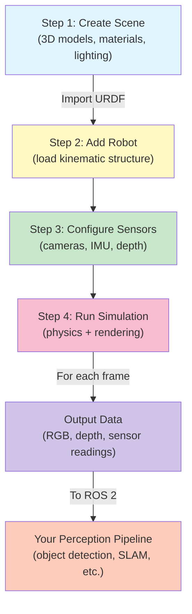

# Chapter 1: Isaac Sim Fundamentals

## Overview

In this chapter, you'll learn what photorealistic simulation is, why it matters for robotics, and how NVIDIA Isaac Sim enables safe, cost-effective training of humanoid robots before deploying them in the real world.

## What You'll Learn

- What photorealistic simulation is and why it's essential for robotics
- How Isaac Sim's physics engine and rendering system work together
- The complete workflow: building 3D scenes, simulating physics, and generating sensor outputs
- Key concepts: coordinate frames, cameras, depth sensors, and collision detection
- Real-world scenarios where simulation saves time and money

## Why Simulation Matters for Robotics

Imagine training a humanoid robot to pick up objects in a real warehouse. Each mistake could:
- Damage expensive equipment
- Take days to reset and try again
- Require human supervision at all times
- Cost thousands of dollars per training iteration

**In simulation**, you can:
- Train thousands of scenarios per hour
- Make mistakes without damage or downtime
- Generate perfect sensor data and labels automatically
- Test edge cases safely before deploying on real hardware

This is why companies like Tesla, Boston Dynamics, and NVIDIA invest heavily in photorealistic simulation before building physical robots.

## Cross-Module Connections

This chapter builds on concepts from **Module 1** and connects to the complete perception-to-action pipeline:

**From Module 1 (ROS 2 Fundamentals)**:
- Your robot's **URDF structure** (Module 1, Chapter 3) gets loaded into Isaac Sim as the robot model
- **ROS 2 topics** (Module 1, Chapter 1) receive sensor data (RGB images, depth maps, IMU readings) from Isaac Sim
- **Autonomous agents** (Module 1, Chapter 2) run control loops that receive simulated sensor data and command robot movements

**To Later Chapters**:
- Chapter 2 shows how to generate **diverse synthetic data** from Isaac Sim for training robust perception models
- Chapter 3 uses **synthetic training data** to teach robots how to localize themselves (VSLAM)
- Chapter 4 combines localization with **path planning** (Nav2) to enable autonomous navigation

**See**: [Module 1, Chapter 3: URDF Model Description](/module1/ch3-urdf-model) for how to prepare robot URDFs for Isaac Sim.

## The Isaac Sim Workflow

Isaac Sim is NVIDIA's photorealistic simulation engine built on the Omniverse platform. Here's how it works:



**The workflow**: Scene → Robot → Sensors → Physics → Output → Perception

### Step 1: Create a 3D Scene

You start with a digital environment:
- **Objects**: 3D models of the robot, objects to manipulate, furniture, obstacles
- **Materials**: Realistic textures (plastic, metal, cloth)
- **Lighting**: Realistic light sources that cast shadows and affect sensor perception
- **Physics Properties**: Mass, friction, material stiffness

### Step 2: Configure Sensors

Add cameras and other sensors to the robot:
- **RGB Cameras**: Color images like human eyes
- **Depth Cameras**: Distance to objects (crucial for object detection)
- **IMU**: Inertial sensors (acceleration, rotation)
- **Joint Encoders**: Feedback on robot joint angles

### Step 3: Run Physics Simulation

The physics engine simulates:
- **Gravity** pulling the robot and objects downward
- **Collisions** when the robot touches objects or walls
- **Friction** preventing objects from sliding endlessly
- **Contacts** between surfaces (gripper holding an object, feet on ground)

All at realistic speed (or faster for training).

### Step 4: Render and Generate Outputs

For each simulation timestep:
- **Render** the 3D scene from camera positions
- **Generate** RGB images, depth maps, and other sensor data
- **Store** position/orientation of all objects (ground truth labels)
- **Output** to ROS 2 topics for your perception pipeline

## Key Concepts: Coordinate Frames

All objects in Isaac Sim exist in a **coordinate frame** (x, y, z position + rotation). Understanding this is crucial:

```
    Z (up)
    |
    +-- X (forward)
   /
  Y (right)
```

**Example**: A humanoid robot's:
- **Base frame**: Center of the torso
- **Head frame**: Where the cameras are mounted
- **Left gripper frame**: The end effector where the hand is

When your perception model says "object at (x, y, z) relative to camera", it's describing a position in the camera's coordinate frame. Isaac Sim makes sure all these frames are correctly aligned.

## Real-World Example: Training a Pick-and-Place Robot

Here's a complete scenario using Isaac Sim:

1. **Scene Setup**: A table with objects (blocks, bottles) and a humanoid robot
2. **Task Definition**: "Pick up the blue block and place it in the red box"
3. **Simulation Loop**:
   - Randomize: object positions, lighting, robot starting pose
   - Render: camera images from 10 angles
   - Simulate: physics (if robot tries to reach, does it collide with table?)
   - Store: ground truth labels (object identity, exact 3D position)
4. **Training**: Feed 10,000 simulated images to a machine learning model
5. **Result**: A perception model trained on diverse scenarios

**Advantages**:
- In 1 hour: 10,000 labeled images
- In real world: would take weeks to collect and label manually
- Perfect automation: zero labeling mistakes
- Infinite variations: sun angles, shadows, textures, object poses

## Limitations of Simulation

Simulation isn't perfect. Here are the main challenges:

### 1. **Sim-to-Real Gap**

A model trained 100% in simulation may not work perfectly on real robots because:
- **Materials look slightly different** in the real world (lighting, texture quality)
- **Sensors behave slightly differently** (camera noise, depth sensor artifacts)
- **Physics approximations** (friction values may not be exact)

**Solution**: Chapter 2 (Synthetic Data) covers **domain randomization**—deliberately adding variations to training data so models learn to be robust.

### 2. **Computational Cost**

Photorealistic rendering is computationally expensive:
- High-quality rendering: 10-50 milliseconds per frame
- Physics simulation: depends on scene complexity
- Solution: Use GPU acceleration (Isaac Sim on NVIDIA GPUs is much faster)

### 3. **Scene Complexity**

Building accurate 3D environments is time-consuming:
- Must model all relevant objects and their properties
- Textures must be realistic for vision models to learn
- Physics parameters must match real-world materials

## Comparison: Isaac Sim vs. Game Engines

You might wonder: **Why not just use Unity or Unreal Engine?**

| Feature | Isaac Sim | Game Engines (Unity/Unreal) |
|---------|-----------|---------------------------|
| **Physics Accuracy** | High-precision robotics physics | Optimized for games (approximate) |
| **Sensor Simulation** | Specialized robotics sensors (IMU, joint encoders) | Generic physics only |
| **GPU Rendering** | Optimized for NVIDIA GPUs | General-purpose |
| **ROS 2 Integration** | Native ROS 2 middleware support | Requires custom bridges |
| **Domain Randomization** | Built-in tools for synthetic data | Must implement manually |
| **Learning Curve** | Robotics-focused | Game development-focused |

**Bottom line**: Isaac Sim is purpose-built for robotic simulation. Game engines are more general-purpose.

## What Happens Next

In Chapter 2, you'll learn how Isaac Sim is used to generate **synthetic training data** at scale. Then in Chapters 3-4, you'll see how trained perception models enable robots to:
- **Localize** (figure out where they are) using VSLAM
- **Navigate** (plan and execute paths) using Nav2

## Key Takeaways

✓ **Isaac Sim is a photorealistic simulation engine** designed specifically for robotics training
✓ **Simulation enables safe, cheap, fast training** compared to real-world robots
✓ **The sim-to-real gap is real**, but manageable with domain randomization (Chapter 2)
✓ **Coordinate frames** are crucial for understanding object positions and sensor data
✓ **Each simulation outputs** can be ground-truth labels for training perception models

## Acronym Reference

| Acronym | Full Name | Definition |
|---------|-----------|------------|
| **Isaac Sim** | NVIDIA Isaac Simulator | NVIDIA's photorealistic simulation engine built on Omniverse for robotics training |
| **Omniverse** | NVIDIA Omniverse | NVIDIA's platform for collaborative 3D design, simulation, and visualization |
| **RGB** | Red-Green-Blue | Color image format with separate channels for red, green, and blue light intensity |
| **IMU** | Inertial Measurement Unit | Sensor measuring acceleration and angular velocity (6-axis) for robot state estimation |
| **URDF** | Unified Robot Description Format | XML format defining robot structure, links, joints, sensors (from Module 1) |
| **ROS 2** | Robot Operating System 2 | Middleware for robot software communication and integration (from Module 1) |
| **GPU** | Graphics Processing Unit | Specialized hardware for fast parallel computation (used by Isaac Sim rendering) |
| **Physics Engine** | Simulation System | Software calculating object motion, collisions, forces, and interactions |
| **Coordinate Frame** | Reference System | Origin point + axes (x, y, z) defining position and orientation in 3D space |
| **Synthetic Data** | Generated Data | Computer-generated training data from simulation, not real-world sensors |

## Next: Chapter 2

Ready to learn how to generate thousands of diverse training images from simulation? Head to **Chapter 2: Synthetic Data Generation**.

---

**Learning Outcome**: You now understand why robotics companies invest in photorealistic simulation and how Isaac Sim enables safe, efficient training before deploying physical robots.
