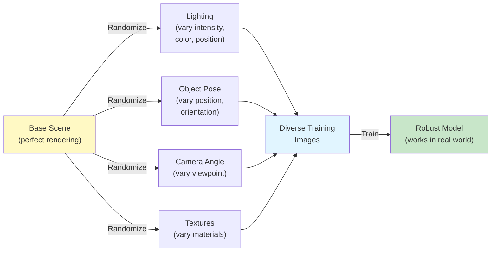

# Chapter 2: Synthetic Data Generation

## Overview

In this chapter, you'll learn how to leverage Isaac Sim to generate **synthetic training data** at massive scale, why this approach is superior to collecting real-world data, and how to address the **sim-to-real gap** using domain randomization.

## What You'll Learn

- What synthetic data is and why it's more efficient than collecting real-world training data
- How to generate diverse variations from a single 3D scene
- The **sim-to-real gap**: why simulation-trained models might not work on real robots
- **Domain randomization**: techniques to make models robust to real-world variations
- Real-world examples of companies using synthetic data for robotics

## Why Synthetic Data is a Game Changer

Imagine you need to train a model to recognize humanoid robots in different poses. In the real world:

**Real-World Data Collection**:
- Hire someone to pose the robot 100 different ways
- Photograph it from 10 different angles
- Repeat with different lighting conditions
- Repeat with different backgrounds
- Total: ~1,000 images, 2-3 weeks of work, significant cost

**Synthetic Data Generation**:
- Configure Isaac Sim scene with robot, lighting, background
- Run automated randomization: vary robot pose, camera angle, lighting
- Generate 10,000 labeled images in 2 hours
- Perfect labels (no human error): exact 3D positions, object identities
- Cost: just GPU compute time

**Why synthetic data wins**:
1. **Speed**: Hours instead of weeks
2. **Scale**: Thousands/millions instead of hundreds
3. **Quality**: Perfect automated labels, no human errors
4. **Consistency**: Same quality across all images
5. **Safety**: No need to risk physical robots during training

## What is Synthetic Data?

Synthetic data is **artificially generated training data** created from simulations rather than captured from the real world.

### Key Characteristics

| Property | Synthetic Data | Real-World Data |
|----------|---|---|
| **Source** | Computer simulation | Physical world sensors |
| **Labels** | Perfect and automatic | Manual annotation (often wrong) |
| **Volume** | Unlimited (generate as many as needed) | Limited (takes time to collect) |
| **Variations** | Controlled and repeatable | Natural variations (hard to control) |
| **Cost** | GPU compute (cheap at scale) | Human labor (expensive) |
| **Consistency** | Uniform quality across all samples | Inconsistent quality |

### Example: Training an Object Detection Model

**Real world**: Collecting 10,000 images of "blue ball" might involve:
- Purchasing 10 blue balls of slightly different shades
- Setting up lighting in different rooms
- Photographing from different angles and distances
- Carefully labeling (x, y, width, height) in each image
- Expected time: 4-6 weeks, cost: $5,000-10,000 (labor)

**Synthetic**: Generating 10,000 images using Isaac Sim:
- Load 3D model of blue ball into Isaac Sim
- Randomize: ball position, camera angle, lighting
- Render and save images with automatic labels
- Expected time: 2-4 hours, cost: ~$10 (GPU time)

**Result**: Same or better quality in 1/100th the time at 1/1000th the cost!

## Domain Randomization: Closing the Sim-to-Real Gap

Here's the problem: A model trained **only** on perfectly rendered Isaac Sim images might fail on real robots because:

**Why the gap exists**:
- **Lighting differences**: Fluorescent office lights vs. natural sunlight
- **Material variations**: The virtual plastic looks different from real plastic
- **Sensor noise**: Real cameras have artifacts, Isaac Sim simulates clean images
- **Motion blur**: Real images have blur from movement; Isaac Sim images are crisp
- **Reflections**: Real world has unexpected reflections off surfaces

### Solution: Domain Randomization

**Domain randomization** deliberately adds variations to synthetic data so the model learns to handle real-world variations:



**How it works**: Instead of rendering the same scene once, we render it thousands of times with random variations. The model learns "this object looks like a ball regardless of lighting, angle, or material."

#### Randomization Technique 1: Lighting Variation

Instead of fixed perfect lighting, randomize:
- **Light position**: Move light source around the scene
- **Light intensity**: Vary brightness (dim to bright)
- **Light color**: Warm yellow to cool blue
- **Shadows**: Strong shadows to diffuse soft lighting

**Result**: Model learns to recognize objects under any lighting condition.

#### Randomization Technique 2: Visual Texture Variation

- **Swap materials**: Plastic → rubber → metal
- **Add wear**: Scratches, dirt, fading on surfaces
- **Vary colors**: Same object in different colors
- **Change backgrounds**: Cluttered vs. empty scenes

**Result**: Model doesn't overfit to a specific texture.

#### Randomization Technique 3: Camera Variations

- **Depth of field**: Some images in focus, some blurry
- **Motion blur**: Simulate moving camera
- **Noise**: Add sensor noise (real cameras are noisy)
- **Chromatic aberration**: Color separation at edges (real camera effect)

**Result**: Model robust to camera quality variations.

#### Randomization Technique 4: Object Pose Variation

- **Position**: Random placement on table (up to boundaries)
- **Rotation**: Spin object in all directions
- **Scale**: Slightly vary size (manufacturing tolerance)
- **Deformation**: Slight bends or deformations

**Result**: Model learns poses from all angles.

## Real-World Example: NVIDIA's Jetbot Training

NVIDIA trained a small mobile robot (Jetbot) for object detection using Isaac Sim:

**Setup**:
- Created 3D models of office objects (laptop, cup, plant)
- Built Isaac Sim scene of an office environment
- Configured randomization: lighting, object positions, camera noise

**Results**:
- Generated 10,000 diverse images in 4 hours
- Model trained in 30 minutes
- Robot deployed in real office environment
- Real-world accuracy: 92% (close to training accuracy)
- Time saved vs. real-world collection: 3 weeks
- Cost saved: ~$8,000 in labor

## The Simulation-to-Real (Sim2Real) Pipeline

Here's the complete pipeline from simulation to real deployment:

```
[Isaac Sim]
    ↓
Configure scene, objects, sensors
    ↓
[Domain Randomization]
    ↓
Vary lighting, textures, poses, camera effects
    ↓
[Generate Dataset]
    ↓
Render 10,000+ diverse images with perfect labels
    ↓
[Train ML Model]
    ↓
Feed synthetic data to neural network
    ↓
[Test in Simulation]
    ↓
Validate model on held-out synthetic test set
    ↓
[Deploy on Real Robot]
    ↓
Run model on real camera feeds
    ↓
[Evaluate]
    ↓
Real-world accuracy should match (or exceed) simulation
```

## Comparison: Different Approaches to Data

| Approach | Time | Cost | Quality | Diversity |
|----------|------|------|---------|-----------|
| **Manual Collection** | Weeks-months | $5k-50k | Variable (human errors) | Limited (depends on effort) |
| **Passive Real-World** | Months | Low | Poor (labels are hard) | High (natural variety) |
| **Synthetic (no randomization)** | Hours | $10-100 | High (perfect) | Low (looks too uniform) |
| **Synthetic + Domain Randomization** | Hours | $10-100 | High (perfect) | **Very High (deliberate variation)** |

**Winner**: Synthetic data with domain randomization for most robotics tasks!

## When to Use Synthetic Data

**Great for**:
- Object detection and classification
- Pose estimation (where is the object?)
- Semantic segmentation (which pixels are what?)
- Self-driving (perception in controlled scenarios)

**Challenges for**:
- Fine tactile sensing (touch feedback)
- Complex deformable objects (cloth, liquids)
- Extreme corner cases (rare events)
- High-precision robotic assembly

For these challenging cases, companies often use **hybrid approaches**: mostly synthetic data + some real-world data to fill gaps.

## Key Challenges in Synthetic Data

### Challenge 1: Photorealism vs. Diversity Trade-off

More randomization (better sim-to-real) = Less photorealism (less realistic):

- **High photorealism**: Clean, beautiful images that look real—but the model overfits to simulation
- **High randomization**: Varied, diverse images—but they might look less realistic

**Solution**: Balance! Use enough randomization to handle real-world variations without making images look obviously fake.

### Challenge 2: Balancing Diversity and Computational Cost

More randomization = More GPU compute:

- **Few variations**: Fast to render (5 hours), but model might fail in real world
- **Many variations**: Slow to render (50 hours), but model more robust

**Solution**: Use **active learning**—generate data strategically in areas where the model is uncertain.

### Challenge 3: The Remaining Sim-to-Real Gap

No amount of domain randomization closes the gap 100%. Why?

- **Isaac Sim is an approximation** of physics (good but not perfect)
- **Real-world has unexpected variations** we didn't randomize for
- **Sensor characteristics** sometimes surprise us (unusual noise patterns)

**Solution**: Always test on real robots! Synthetic data gets you 80% of the way; real testing gets you to 99%.

## What Happens Next

Now you understand:
- **How to train perception models** using synthetic data (this chapter)
- **That trained perception enables robots to localize** (next: Chapter 3 VSLAM)
- **That localization enables navigation** (Chapter 4: Nav2)

In Chapter 3, you'll see how a humanoid robot uses its trained perception model and a single camera to figure out where it is in the world and build a map—all without GPS!

## Key Takeaways

✓ **Synthetic data is dramatically faster and cheaper** than collecting real-world data
✓ **Perfect automated labels** from simulation eliminate human annotation errors
✓ **Domain randomization** bridges the sim-to-real gap by training on diverse variations
✓ **The pipeline works**: Hundreds of companies use sim-trained models on real robots
✓ **Real-world testing is still essential** to validate that sim-trained models work

## Next: Chapter 3

Your robot is now trained (from synthetic data). But how does it know **where it is** in the real world? Find out in **Chapter 3: Isaac ROS VSLAM**.

---

**Learning Outcome**: You now understand why synthetic data is more efficient than real-world collection, how domain randomization makes models robust, and why companies use this approach to train perception systems.
