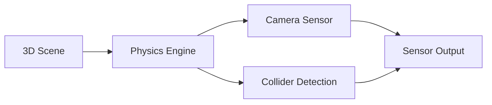
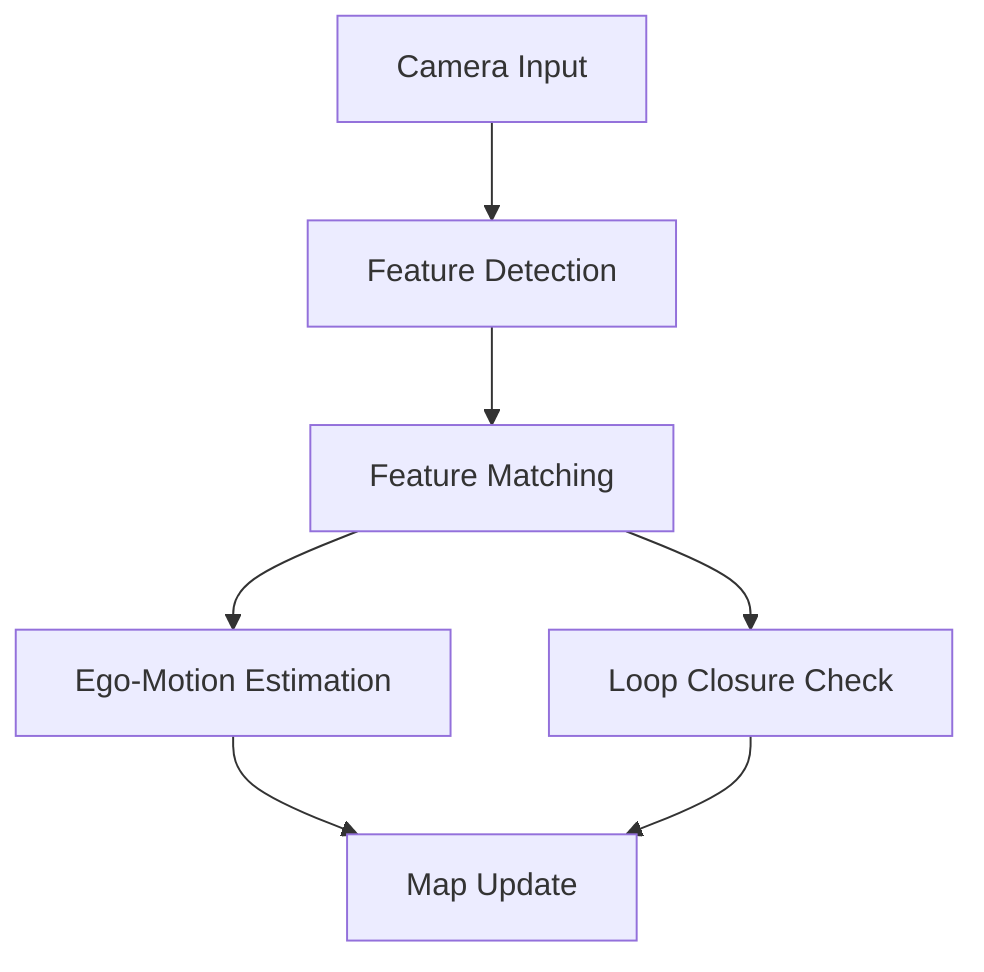
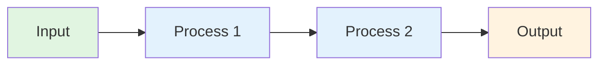

# Module 3 Diagram Patterns & Reference Guide

**Purpose**: Define diagram styles and patterns used consistently across all 4 chapters
**Created**: 2025-12-08 | **Feature**: 003-isaac-brain

---

## Pattern A: Conceptual Architecture Diagram (Mermaid)

**Used for**: Component relationships, system architecture, data flow overview

**Mermaid Syntax Example**:



**When to use**:
- Chapter 1: Scene → Physics → Sensors data flow
- Chapter 2: Data generation pipeline
- Chapter 3: VSLAM component relationships
- Chapter 4: Nav2 planning architecture

**Characteristics**:
- Left-to-right flow (LR) for process flows
- Top-to-bottom (TD) for hierarchies
- 3-6 nodes for clarity
- Clear labels on nodes
- Arrow descriptions optional but helpful

---

## Pattern B: Workflow Sequence Diagram (Mermaid)

**Used for**: Step-by-step processes, algorithmic flows, sequential operations

**Mermaid Syntax Example**:



**When to use**:
- Chapter 1: Isaac Sim workflow (scene → physics → execution)
- Chapter 2: Data generation process (configure → generate → export)
- Chapter 3: Visual odometry and VSLAM pipeline
- Chapter 4: Path planning execution (global → local → motion)

**Characteristics**:
- Sequential steps numbered or visually implied
- Decision points (diamond shapes optional)
- Clear input/output labels
- 5-8 steps for moderate complexity workflows

---

## Pattern C: Table/Grid Representation (ASCII)

**Used for**: Costmaps, diversity dimensions, comparison matrices

**ASCII Syntax Example** (Costmap):

```
[Free ] [Free ] [Free ] [Free ]
[Free ] [Robot] [Free ] [Free ]
[Free ] [Wall ] [Wall ] [Free ]
[Free ] [Free ] [Obs  ] [Free ]
```

**ASCII Example** (Diversity Dimensions):

```
Dimension          | Low            | Medium       | High
-------------------|----------------|--------------|------------------
Lighting           | Bright only    | Mixed        | Varied + shadows
Poses              | Front-facing   | 45 deg       | Full 360
Viewpoints         | Single angle   | 2-3 angles   | 6+ angles
Backgrounds        | Plain white    | Textured     | Complex scenes
```

**When to use**:
- Chapter 2: Data diversity table
- Chapter 4: Costmap visualization
- Any chapter: Feature comparison tables

**Characteristics**:
- Simple ASCII characters (no unicode)
- Aligned columns for readability
- Clear headers
- Fits within markdown code blocks

---

## Pattern D: Tree/Hierarchical Structure (ASCII)

**Used for**: Hierarchies, decision trees, component breakdowns

**ASCII Syntax Example** (Coordinate Frames):

```
World Frame (fixed)
    |
    +-- Robot Base Frame
            |
            +-- Torso Frame
                    |
                    +-- Left Arm Frame
                    +-- Right Arm Frame
                    +-- Head Frame
            |
            +-- Left Leg Frame
            +-- Right Leg Frame
```

**When to use**:
- Chapter 1: Coordinate frame hierarchies
- Chapter 3: VSLAM feature hierarchy
- Chapter 4: Planning hierarchy (global → local)

**Characteristics**:
- Indentation for nesting
- Pipe characters (|) and plus signs (+) for structure
- Clear parent-child relationships
- 3-4 levels deep for readability

---

## Pattern E: Visual Description (Prose)

**Used for**: Complex concepts better explained in text than diagrams

**Prose Example**:

"Imagine the robot is exploring a new building. As it moves:

1. **Capture**: Camera sees new features (corners, edges, textures)
2. **Track**: Next frame, those same features appear in slightly different positions
3. **Match**: Robot matches features between frames (correspondence)
4. **Estimate**: From the feature displacements, calculate how far/fast the robot moved
5. **Update**: Add new features to the map; update robot's position estimate
6. **Loop Close**: As the robot returns to familiar areas, confirm position by recognizing old features

This cycle repeats hundreds of times per second, building a rich map and accurate pose."

**When to use**:
- Explaining complex algorithms (VSLAM, path planning)
- Scenarios where ASCII/Mermaid would be unclear
- Step-by-step processes needing narrative flow

**Characteristics**:
- 5-10 sentences maximum
- Numbered or bulleted steps
- Plain language accessible to beginners
- Concrete scenarios (robots, real-world examples)

---

## Diagram Count Per Chapter

| Chapter | Type A (Architecture) | Type B (Workflow) | Type C (Table) | Type D (Tree) | Type E (Prose) | Total |
|---------|----------------------|-------------------|----------------|---------------|----------------|-------|
| **Ch 1** | 1 (Scene→Physics) | 1 (Sim workflow) | 0 | 1 (Frames) | 0 | 3 |
| **Ch 2** | 1 (Data pipeline) | 1 (Gen workflow) | 1 (Diversity) | 0 | 1 (Domain adaptation) | 4 |
| **Ch 3** | 1 (VSLAM arch) | 2 (Odometry, loop closure) | 0 | 1 (Frame hierarchy) | 1 (VSLAM process) | 5 |
| **Ch 4** | 1 (Nav2 arch) | 2 (Global/local planning, replan) | 1 (Costmap) | 0 | 1 (Planning narrative) | 5 |

---

## Diagram Placement Guidelines

### Section 1: Core Concepts
- **Best for**: Type C (Table) or Type E (Prose) explaining key terms
- **Example**: Diversity dimensions table in Chapter 2
- **Frequency**: 0-1 per section

### Section 2: Architecture & Workflow
- **Best for**: Type A (Architecture) + Type B (Workflow sequences)
- **Example**: VSLAM pipeline diagram in Chapter 3
- **Frequency**: 1-2 per section (A + B required)

### Section 3: Real-World Applications
- **Best for**: Type E (Prose) or Type C (Table) comparing scenarios
- **Example**: Describing humanoid's exploration in Example 1
- **Frequency**: 0-1 per section

### Section 4: Integration & ROS 2
- **Best for**: Type A (Architecture) showing ROS 2 connections
- **Example**: VSLAM node → pose topic connections
- **Frequency**: 0-1 per section

### Section 5: Key Takeaways
- **Best for**: No diagrams (text only)
- **Frequency**: 0

### Edge Cases & Troubleshooting
- **Best for**: Type E (Prose) describing scenarios
- **Example**: Featureless wall scenario in Chapter 3
- **Frequency**: 0-1

---

## Mermaid Diagram Template



**Notes**:
- Use meaningful node labels
- Add descriptions on arrows if helpful
- Keep styling consistent within chapter
- Test rendering before submission

---

## ASCII Diagram Best Practices

1. **Alignment**: Use monospace font (code blocks)
2. **Characters**: Stick to basic ASCII (|, +, -, =, >, <, ^, v)
3. **Spacing**: Consistent padding for readability
4. **Size**: Fit within standard terminal width (80 chars)
5. **Clarity**: Add legend or labels as needed

---

## Examples by Chapter

### Chapter 1: Isaac Sim - Scene to Physics to Sensors

```
[3D Scene]
    ↓
[Import model, set textures, set physics]
    ↓
[Physics Engine]
    ├─ Calculate forces, collisions
    └─ Update object states
    ↓
[Sensors]
    ├─ RGB Camera → Image
    ├─ Depth Camera → Point Cloud
    └─ IMU → Acceleration data
    ↓
[Simulation Output]
```

### Chapter 2: Synthetic Data - Diversity Dimensions

```
Lighting    : Bright | Dim | Shadows | Colored lights | Mixed
Poses       : Front  | Left | Right | Top | Bottom | Angles
Viewpoints  : Close | Medium | Far | Left | Right | Top
Backgrounds : Plain | Textured | Complex | Clutter | Real
```

### Chapter 3: VSLAM - Feature Tracking Loop

```
Frame 1: [Feature A at (100,150)]
    ↓ camera moves
Frame 2: [Feature A now at (105,155)]
    ↓ calculate displacement
Motion: Robot moved ~5 pixels right, ~5 pixels down
    ↓ repeat for 100+ features
Ego-Motion Estimate: Robot translation = [0.1m, 0, 0.05m]
    ↓
Update Map & Pose
```

### Chapter 4: Nav2 - Planning and Execution

```
Goal: [10, 10] in map
    ↓
Global Planner: Find path around obstacles
    ↓
Path: [0,0] → [2,1] → [4,2] → [6,4] → [8,6] → [10,10]
    ↓
Local Planner: Execute next 5 points carefully
    ↓
Motion Controller: Send velocity commands
    ↓
[Robot moves along path]
```

---

## Accessibility Notes

- **Alt text**: Always provide ASCII or text description alongside Mermaid
- **Color**: Don't rely on color alone; use shapes/patterns
- **Size**: Keep text readable (12pt minimum in rendered output)
- **Contrast**: Ensure sufficient contrast between elements

---

## Implementation Checklist

When creating diagrams:

- [ ] Diagram type (A/B/C/D/E) identified
- [ ] Diagram content accurate to chapter content
- [ ] Mermaid syntax validated (renders without errors)
- [ ] ASCII diagrams properly aligned in code blocks
- [ ] Placement within correct section (1-4 or edge cases)
- [ ] Alt text or prose description provided
- [ ] Terminology matches glossary (see data-model.md)
- [ ] Cross-chapter consistency maintained

---

**Reference**: Use this guide when writing each chapter. Refer back to examples if diagram clarity is uncertain.
