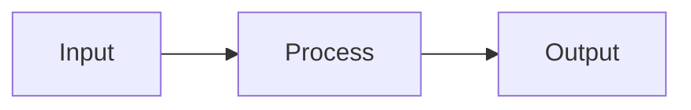

# Chapter N: [Full Chapter Title]

## Learning Objectives

- [ ] Learning objective 1
- [ ] Learning objective 2
- [ ] Learning objective 3
- [ ] Learning objective 4

## Prerequisites & Context

Brief mention of what students should already know. Review links to Module 1 chapters if relevant.

## Section 1: Core Concepts

### 1.1 [Concept A]

**Definition**: Clear, beginner-friendly definition in 1-2 sentences.

**Why it matters**: Explain relevance to robotics and this module.

**Relationship to other concepts**: How does this connect to other ideas in the chapter?

**Real-world example**: One sentence showing practical application.

### 1.2 [Concept B]

[Same structure as 1.1]

### 1.3 [Concept C]

[Same structure as 1.1]

**Word target for Section 1**: 1,200-1,600 words

---

## Section 2: Architecture & Workflow

### [Workflow Name] Pipeline

[Brief introduction explaining what this section covers]

**Step-by-step workflow**:

1. **Step 1 - [Name]**: Explain what happens
2. **Step 2 - [Name]**: Explain what happens
3. **Step 3 - [Name]**: Explain what happens

**Data flow**: Describe how data moves through the system.

**Component interactions**: How do different parts work together?

**Word target for Section 2**: 1,000-1,300 words

---

## Section 3: Real-World Applications & Examples

### Example 1: [Application Scenario 1]

**Context**: Set the scene - what's the humanoid robot doing?

**How the chapter's concepts apply**:
- Concept A is used for...
- Concept B enables...
- Concept C helps with...

**Relevant NVIDIA Isaac features**:
- Feature 1 supports...
- Feature 2 enables...

### Example 2: [Application Scenario 2]

[Same structure as Example 1]

**Word target for Section 3**: 800-1,000 words

---

## Section 4: Integration with ROS 2 & Module 1

### How This Chapter Connects to Module 1

**Link to [Module 1 Chapter X]**: [See Module 1 Chapter X for [topic]](/docs/module1/chapterX-topic)

Explain how this chapter's concepts relate to the referenced Module 1 chapter.

**Relevant ROS 2 nodes, topics, and services**:
- Node 1: Subscribes to... and publishes...
- Topic 1: Contains...
- Service 1: Enables...

**Practical workflow combining Module 1 + Module 3**:

1. Module 1 concept provides the foundation...
2. Module 3 builds on this by...
3. Together they enable...

**Word target for Section 4**: 500-700 words

---

## Section 5: Key Takeaways

### Core Idea 1

One-sentence summary followed by brief elaboration (2-3 sentences).

### Core Idea 2

One-sentence summary followed by brief elaboration.

### Core Idea 3

One-sentence summary followed by brief elaboration.

### Bridge to Next Chapter

What's next? How does this chapter prepare students for the next topic?

**Word target for Section 5**: 200-250 words

---

## Edge Cases & Troubleshooting

### [Edge Case from Specification]

**Scenario description**: What situation does this edge case describe?

**Why it happens**: What causes this situation?

**How [Isaac Technology] handles it**: Explain the solution or mitigation strategy.

**Student learning outcome**: What should students understand about this edge case?

**Word target for Edge Cases**: 250-400 words

---

## What's Next

**Next chapter preview**: Brief description of Chapter N+1 and how it builds on this chapter.

---

**Estimated reading time**: 12-15 minutes | **Estimated word count**: 5,000 words
**Keywords**: [keyword1, keyword2, keyword3...]

---

## Template Notes

- Replace `[bracketed items]` with actual content
- Maintain consistent terminology (use glossary as reference)
- Keep language at Flesch-Kincaid grade 10-12
- Include Mermaid diagrams and ASCII descriptions
- Link to Module 1 chapters as appropriate
- Address all acceptance criteria (AC-N.1 through AC-N.5)
- Test readability and accuracy after writing
